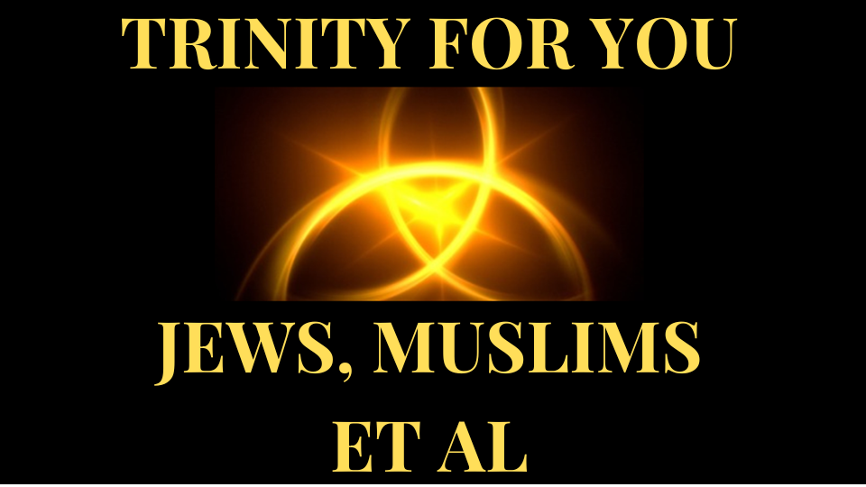

Насколько идентичны 2 человека?

Какое это имеет отношение к Троице.

** Здравствуйте, и добро пожаловать: живи выше 3d.

** <u> Троица </u> **
Троица - это доктрина.

Доктрина - это вера или набор убеждений, преподаваемая церковью.

Троица - это вера, преподаваемая большинством христианских церквей, которая определяет одного бога, существующего в трех совместных божественных лицах.

Как можно существовать у 3 человек?

Как вы можете себе представить, ранняя церковь боролась за эту доктрину.
Они в конечном итоге уменьшили свою веру в Троицу до двух коротких утверждений

. Они пришли к выводу, что Бог по сути, но три в

Человек.
возможно ли для Бога быть одним из них, но три лично?
Давайте узнаем.
** <U> Один, но больше </u> **

Скажем, у нас есть 2 брата по имени: Том и Джерри; Давайте попробуем рассказать им

отдельно!

Давайте попробуем рассказать им отдельно.

Ну, мы можем сказать им их внешность.
Что, если они были идентичными близнецами?

Если Том и Джерри являются идентичными близнецами, то мы могли бы сказать им отдельно от

их отпечатка пальца.

Что делает отпечаток пальца уникальным, так это то, что они не определены генетически

.
скорее, они образуются в утробе матери, в результате внешних процессов.

для Тома, чтобы иметь такой же отпечаток пальца, как и Джерри, ему придется
испытать тот же процесс, что и Джерри, в утробе матери.

Вы видите, наш опыт формирует, кто мы есть, в дополнение к нашей ДНК.

это означает, что независимо от того, насколько похожи атомы Тома и Джерри, их
переживания сделают их разными.

Чтобы быть действительно одинаковым, и Том, и Джерри придется испытать

точно такие же события.  
это означает, что наш опыт, а также материал, из которого мы сделаны,

Shape, кто мы есть.
это теоретически звучит.

Тем не менее, для двух существ не обращается с тем же самым опытом
; Или это?

Представьте, что у Тома и Джерри были те же атомы.
Они также ходят в одни и те же места и делают то же самое, чтобы испытать

те же события.

Однако, как бы они ни старались, они только испытали:
«почти похожие события».

Солнце может упасть немного больше на Тома, чем на Джерри.

при рождении, хотя они лежат рядом друг с другом, капля жидкости
с потолка, может приземлиться на Тома, а не на Джерри.

это означает, что действительно испытать одни и те же события, оба существа будут всегда занимать одно и то же пространство и время.
Могут ли они быть все еще сказать 2 разных существ, если они всегда занимают

одно и то же пространство и время?

Какое отношение все это связано с Троицей?
Что, если Том был омни-представлен?  

** <u> Вездесущность и Троица </u> **
-это омни-предложение, вводит поворот.

Омни-представленное существо будет во всем пространстве и времени.
это означает, что в Omni-Present Tom будет испытывать все пространство и время.

То же самое относится и к омни-представленному Джерри.

это означает, что и Том, и Джерри испытывают одно и то же пространство и время

, а именно: «все пространство и время».
Если и все-представленные Том, и омни-представленные Джерри, сделаны из точного

того же материала, то они должны быть одинаковыми.  

они одинаковы, потому что они буквально одинаковый материал.

Каждый также испытывает все другие переживания.

Если бы вы сказали Omni-Present Tom Что-то, омни-президент Джерри тоже бы это услышал.

Если бы вы видели Omni-Present Tom по дороге в Costco, вы бы тоже видели

Omni-Present Jerry.
ты знаешь, что когда Филипп попросил Иисуса: «Покажи нам Отца».

Иисус ответил: «Я так долго с тобой, и все же ты не знал
меня, Филипп? Кто бы меня видел, видел отца ».  

это относится к любому количеству омни-представленных существ.
это интересно, потому что все 3 человека Троицы-

Omni-Present.

это объясняет, почему они одна сущность, но 3 человека.

Неудивительно, что если вы видели Иисуса, то вы видели Отца.
Троица в действии.

** <u> Слово, Дух, Бог </u> **
Проще говоря, Троица означает, что:

Слово Божье - это Бог.

Дух Божий - это Бог.
Мы можем понять, как Дух Божий - это Бог.

Мы просто думаем: «Мой дух - это я, так что Дух Божий - это Бог».
Но мы редко думаем: «Мое слово - я».

Ваши слова?

Раньше мы показали, что материал, из которого мы изготовлены, а также наш
, форма, кто мы есть.

Из какой материал дух сделан?

определенно не физический материал.

Библия позволяет нам понять, что все было создано словом

Бога.

Итак, духи сделаны из слов, в частности Слова Божьего.

как насчет опыта духа; Под этим я имею в виду, что влияет на дух

?

на человека может повлиять тепло, холод, страх и боль.

Что может повлиять на дух?

Иисус сказал, что произнесенные слова содержат духовную жизнь.

Жизнь относится к чему -то, что оживляет, так что слова, произнесенные

Иисус, содержат что -то, что оживляет.
это означает, что слова, произнесенные Иисусом, влияют на Дух.

Итак, слова влияют на дух.

Под словами мы подразумеваем слышимые слова, видимые слова, образы и другие формы общения

, которые создают впечатление в духе.
Раньше мы показали, что материал, из которого мы изготовлены, а также наш

, форма, кто мы есть.

Теперь мы показали, что духи сделаны и под влиянием: «Слова».
это означает, что дух формируется суммой всех слов, которые он верит.

Неудивительно, что Библия говорит: «Как человек думает в своем сердце, как и он».

Слова в вашем сердце, ты.

Я имею в виду настоящий тебя; Дух ты.

Неудивительно, что Библия показывает, что человек совершенен, если его слова
идеальны.

Если наши слова мы, а наш дух - это мы, значит ли это, что каждый человек - это троица?

Ну, мы не троица, потому что у наших слов нет собственной личности.

или они?
Что ты думаешь?

Дайте мне знать в разделе комментариев.
** Спасибо за прослушивание. **

** Поделитесь этим с кем -то, кому нужно знать. Следуйте за нами, чтобы узнать больше. **

** <U> Узнайте больше </u> **
Веб -сайт: [http://liveabove3d.com] (http://liveabove3d.com)

Youtube:

[https://www.youtube.com/@live.above.3dø(https://www.youtube.com/@live.above.3d)

tiktok:

[ https://www.tiktok.com/@live.above.3dцин(Https://www.tiktok.com/@live.above.3d)
Twitter: @live \ _above \ _3d

[ https://twitter.com/live\_above\_3dцин(Https://twitter.com/live_above_3d)
reddit: live-above-3d [https://www.reddit.com/user/live- Выше-3d] (https://www.reddit.com/user/live-above-3d)

instagram: [https://www.instagram.com/live.above.3d!(https:///////////////////////////////////////////////////////////////////////////////////////////////////////////////////////WWW.INSTAGRAM.COVE). www.instagram.com/live.above.3d)
facebook:

[https://www.facebook.com/profile/100092339087423(https://www.facebook.com/profile/100092339087423)

** <u> Библейские стихи </u> **

 8  Филипп говорит ему, Господь, покажи нам Отца, и это

нас.

 9  Иисус говорит ему, я так долго был с

, и все же не знал меня, Филипп? Тот, кто видел меня, видел отца; И как ты тогда говоришь, покажи нам отца?

Иоанна 14: 8-9
**  1  В начале было словом, и слово было с Богом,

, и слово было Богом. **
 2  то же самое было в начале с Богом.

**  3  все было сделано им **; и без него не было
ничего, что было сделано.

Иоанна 1: 1-3

это тот дух, который QuickEdet; плоть ничего не получает ничего: ** слова

, о которых я говорю вам, они дух, и они жизнь. **
Иоанна 6:63 Он **: ешь и пить, говорит он

для тебя; Но его сердце не с тобой.

Притчи 23: 7
Ибо во многих вещах мы оскорбляем всех. ** Если кто -то не оскорбляет слово, то же самое - идеальный человек **, и способен также ослабнуть все тело.

Иакова 3: 2
** Не то, что попадает в рот, оскверняет человека; Но то, что
выходит из уст **, это оскверняет человека.

Mathew 15:11   ибо

** из численности сердца говорит рот. **
Мэтью 12:34

