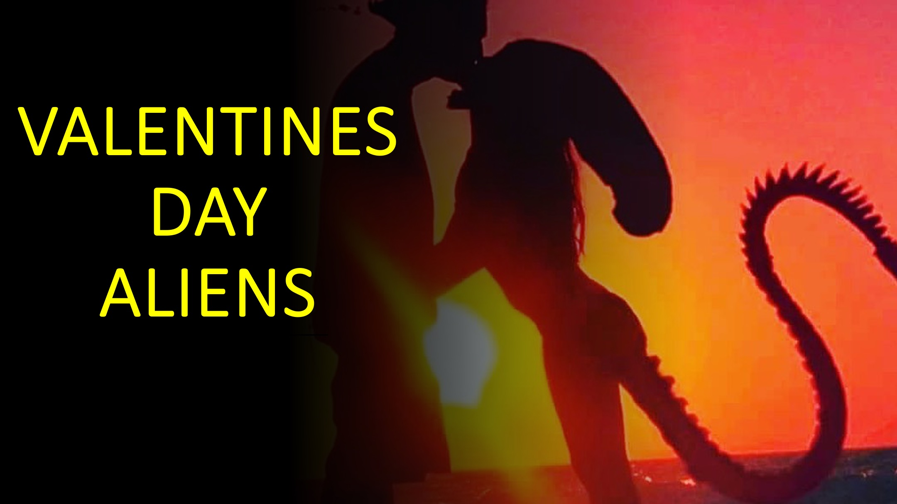

Certains ont affirmé qu'il y avait plusieurs races extraterrestres sur Terre aujourd'hui.

Ce qu'ils ne vous diront pas, c'est comment l'amour a influencé les humains de la race extraterrestre

avec qui s'associer.

** Bonjour, et bienvenue à: Live au-dessus de la 3d. **

Ce qui suit peut avoir eu lieu ou non.

Quatre races extraterrestres ont approché la Terre.

Ils ont annoncé qu'ils avaient une offre pour les humains.

Chaque race extraterrestre a offert aux humains une vie sans pauvreté, guerre, maladie et

tous les problèmes auxquels nous sommes actuellement confrontés.

Nos dirigeants étaient excités et ont commencé des discussions détaillées avec les extraterrestres.

Les courses extraterrestres 1 et 2 disent que leur offre est facultative.

En revanche, les courses extraterrestres 3 et 4 disent chacune que leur offre est

exclusive, et nous ne devons accepter qu'une seule offre.

En fait, les courses 3 et 4 affirment chacune que l'humanité subirait une grande

misère si nous acceptons une offre autre que la leur.

Certains de nos dirigeants ont observé que le mode d'approche de la race extraterrestre 1

et 2 était plus amical.

Cependant, d'autres ont noté que le rejet de la race 1 ou 2 n'avait aucun inconvénient.

Les délibérations ont duré de nombreuses années et les gouvernements.

Début 2012, nos dirigeants ont décidé qu'il valait mieux accepter

race 3 ou 4.

La question par la suite était laquelle des deux races devait accepter les humains.

C'était très important parce que l'une ou l'autre race a clairement indiqué que le rejet

signifiait la guerre et la misère pour les humains.

Le 14 février 2023, nos dirigeants ont décidé de la race 4.

Les détails sont sommaires, mais voici le raisonnement présumé.

Les deux et 4 ont semblé pouvoir faire progresser beaucoup les humains.

sur le revers, rejetant la race 3 ou 4 mènerait à la misère pour l'humanité

.

malgré les similitudes entre les races 3 et 4, une chose a mis la course 4

.

Covid-19 aurait été inspiré par l'une des quatre races extraterrestres.

comment cela a été fait, est au-delà de la portée d'aujourd'hui.

Cependant, chacune des races prétendait être innocente.

Ensuite, le leader de la race 4 a fait quelque chose d'unique.

Le chef de la race extraterrestre 4 a dissous leur avatar dans cet avion.

Un avatar est une icône ou une figure représentant une personne en particulier.

Les extraterrestres utilisent des avatars afin qu'ils puissent éviter la longue distance et les dangers

du voyage spatial.

En dissolvant leur avatar, le leader de la race 4 pourrait exister en tant que temps et espace transcendant et transcendant.

Le leader a ensuite pu voir la cause de Covid et la meilleure façon de le résoudre.

Je ne connais pas la manière exacte qu'ils l'ont fait, mais cela avait à voir avec

manipulant la chronologie pour que Covid-19 soit devenu beaucoup plus fort que

la grippe.

Ce sacrifice a sauvé l'humanité. Cependant, c'était au prix de l'influence

du leader de la race extraterrestre 4.

Cela distingue la course extraterrestre 4 des autres.

C'est pourquoi nos dirigeants ont choisi la race 4 et sont sur le point d'annoncer l'existence

des extraterrestres dans les prochains mois.

L'agent qui m'a dit que cette histoire a résumé leur décision de cette façon:

Lorsque vous choisissez un supérieur, choisissez celui qui aime (ou sacrifie) sur un

qui est qualifié.

Lors du choix d'un subordonné, choisissez-en celui qui soumet (ou est fidèle) sur

celui qui est qualifié.

Voici la sagesse.

Les quatre races extraterrestres sont différents types de religions.

Les types 1 et 2 sont des religions facultatives. Il n'y a aucun inconvénient à rejeter ces religions.

Les types 3 et 4 sont des religions qui ne sont pas facultatives. Ces religions

ont souvent un concept d'enfer ou une forme de punition éternelle pour

non-fuls.

De plus, les deux types 3 et 4 expliquent cette punition à la suite d'un Dieu juste

.

Cependant, seul Dieu de type 4 aide avec amour les humains à échapper à la punition

par le sacrifice.

Que pensez-vous que votre religion est?

Faites-moi savoir dans la section des commentaires.

Bonne Saint-Valentin et ** Merci d'avoir écouté. **

** Partagez ceci avec quelqu'un qui a besoin de savoir. Suivez-nous pour en savoir plus. **

** <u> En savoir plus </u> **

Site Web: <http://liveabove3d.com>

YouTube:

[<u> https://www.youtube.com/@live.above.3d </u>] (https://www.youtube.com/@live.above.3d) ~~ ~

tiktok:

[<u> https://www.tiktok.com/@live.above.3d </u>] (https://www.tiktok.com/@live.above. 3d)

Twitter: @Live \ _above \ _3d

[<u> https://twitter.com/live\_above\_3d </u>] (https://twitter.com/ live_above_3d)

reddit: live-above-3d <https://www.reddit.com/user/live-above-3d>

Instagram: <https: //www.instagram .com / live.above.3d>

Facebook:

[<u> https://www.facebook.com/profile/100092339087423 </u>] (https: //www.facebook .com / Profil / 100092339087423)