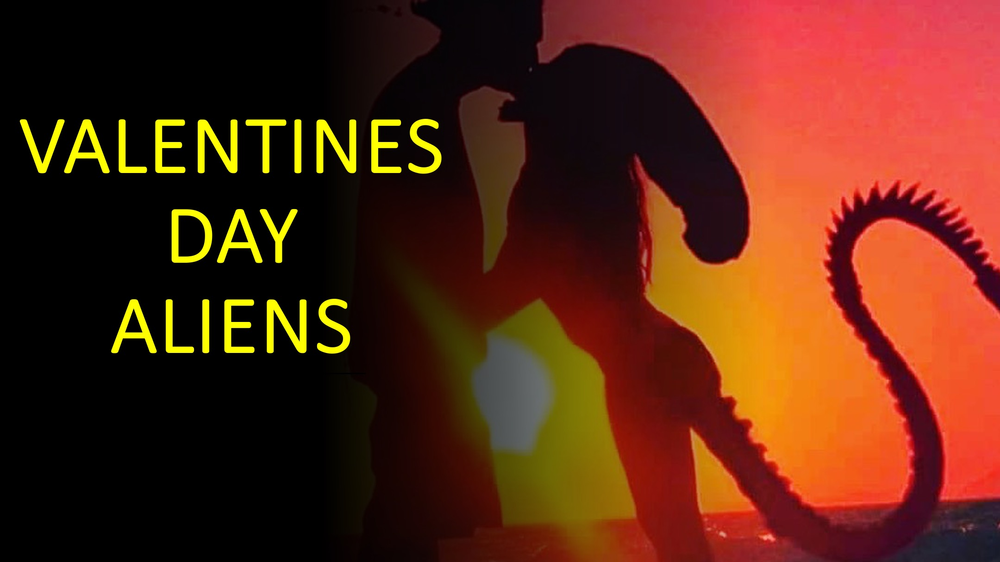

कुछ ने दावा किया है कि आज पृथ्वी पर कई विदेशी दौड़ हैं।

क्या उन्होंने आपको यह नहीं बताया कि प्यार कैसे प्रभावित हुआ, जो विदेशी जाति के मनुष्यों को प्रभावित करता है

ने भागीदार के लिए चुना।

** हैलो, और आपका स्वागत है: 3 डी से ऊपर लाइव। **

निम्नलिखित हो सकता है या नहीं हो सकता है।

चार विदेशी नस्लें पृथ्वी पर पहुंच गई हैं।

उन्होंने घोषणा की कि उनके पास मनुष्यों के लिए एक प्रस्ताव है।

प्रत्येक विदेशी जाति ने मनुष्यों को गरीबी, युद्ध, बीमारी और

के बिना जीवन की पेशकश की, जो वर्तमान में हमारे सामने आने वाली सभी समस्याएं हैं।

हमारे नेता उत्साहित थे और एलियंस के साथ विस्तृत बातचीत शुरू की।

एलियन रेस 1 और 2 प्रत्येक का कहना है कि उनका प्रस्ताव वैकल्पिक है।

दूसरी ओर, एलियन रेस 3 और 4 प्रत्येक का कहना है कि उनका प्रस्ताव

अनन्य है, और हमें केवल एक प्रस्ताव को स्वीकार करना होगा।

वास्तव में, रेस 3 और 4 प्रत्येक का दावा है कि मानव जाति महान

दुख को पीड़ित करती है यदि हम उनके अलावा किसी अन्य प्रस्ताव को स्वीकार करते हैं।

हमारे कुछ नेताओं ने देखा कि एलियन रेस 1

और 2 के दृष्टिकोण का तरीका अधिक अनुकूल था।

हालांकि, अन्य लोगों ने कहा कि दौड़ 1 या 2 को अस्वीकार करने से कोई नकारात्मक पक्ष नहीं था।

विचार कई वर्षों और सरकारों तक चला।

2012 की शुरुआत में, हमारे नेताओं ने फैसला किया कि

रेस 3 या 4 को स्वीकार करना बेहतर था।

इसके बाद सवाल यह था कि दो नस्लों में से कौन से मनुष्यों को स्वीकार करना चाहिए।

यह बहुत महत्वपूर्ण था क्योंकि या तो दौड़ ने यह स्पष्ट कर दिया कि अस्वीकृति

का मतलब है कि मनुष्यों के लिए युद्ध और दुख।

14 फरवरी 2023 को, हमारे नेताओं ने रेस 4 पर फैसला किया।

विवरण स्केच हैं, लेकिन यहां कथित तर्क है।

दोनों रेस 3 और 4 दोनों ही मनुष्यों को बहुत आगे बढ़ाने में सक्षम लग रहे थे।

फ्लिप साइड पर, रेस 3 या 4 को अस्वीकार करने से

मानव जाति के लिए दुख होगा।

दौड़ 3 और 4 के बीच समानता के बावजूद, एक बात ने दौड़ 4

को अलग कर दिया।

कोविड -19 को चार विदेशी दौड़ में से एक से प्रेरित होने का आरोप लगाया गया था।

यह कैसे किया गया, आज के दायरे से परे है।

हालांकि, प्रत्येक दौड़ ने निर्दोष होने का दावा किया।

तब, रेस 4 के नेता ने कुछ अनोखा किया।

एलियन रेस 4 के नेता ने इस विमान पर अपने अवतार को भंग कर दिया।

एक अवतार एक आइकन या आंकड़ा है जो किसी विशेष व्यक्ति का प्रतिनिधित्व करता है।

एलियंस अवतारों का उपयोग करते हैं ताकि वे लंबी दूरी से बच सकें और अंतरिक्ष यात्रा के

खतरों से बच सकें।

अपने अवतार को भंग करके, रेस 4 का नेता एक उच्च

आयामी, पारगमन समय और स्थान के रूप में मौजूद हो सकता है।

नेता तब कोविड के कारण को देखने में सक्षम था और

को हल करने का सबसे अच्छा तरीका था।

मुझे यह पता नहीं है कि उन्होंने ऐसा किया है, लेकिन यह

के साथ समयरेखा में हेरफेर करना था ताकि कोविड -19

फ्लू की तुलना में बहुत मजबूत न हो।

इस बलिदान ने मानव जाति को बचाया। हालाँकि, यह एलियन रेस 4 के नेता के

प्रभाव की कीमत पर था।

इस सेट एलियन रेस 4 को दूसरों के अलावा।

यही कारण है कि हमारे नेताओं ने एलियन रेस 4 को चुना और आने वाले महीनों में एलियंस के

अस्तित्व की घोषणा करने के लिए तैयार हैं।

जिस एजेंट ने मुझे यह कहानी बताई, उसने इस तरह से अपना निर्णय लिया:

एक श्रेष्ठ चुनते समय, एक को चुनें जो एक

से अधिक प्यार करता है (या बलिदान) जो योग्य है।

जब कोई अधीनस्थ चुनते हैं, तो एक चुनें जो

एक से अधिक सबमिट करता है (या वफादार है) जो योग्य है।

यहाँ ज्ञान है।

चार विदेशी दौड़ विभिन्न प्रकार के धर्म हैं।

प्रकार 1 और 2 ऐसे धर्म हैं जो वैकल्पिक हैं। इन धर्मों को अस्वीकार करने के लिए

के लिए कोई नकारात्मक पहलू नहीं है।

प्रकार 3 और 4 ऐसे धर्म हैं जो वैकल्पिक नहीं हैं। इन धर्मों

में अक्सर नरक की अवधारणा होती है या

गैर-फुफ्फुसीय के लिए शाश्वत सजा का कुछ रूप होता है।

इसके अलावा, दोनों प्रकार 3 और 4 इस सजा को एक सिर्फ

भगवान के परिणाम के रूप में समझाते हैं।

हालांकि, केवल टाइप 4 का ईश्वर प्रेमपूर्वक मानवीयों को सजा से बचने में मदद करता है

बलिदान के माध्यम से।

आपको क्या लगता है कि आपका धर्म क्या है?

मुझे टिप्पणी अनुभाग में बताएं।

हैप्पी वेलेंटाइन डे और ** सुनने के लिए धन्यवाद। **

** इसे किसी ऐसे व्यक्ति के साथ साझा करें जिसे जानने की जरूरत है। अधिक जानने के लिए हमें फॉलो करें। **

** <u> अधिक जानें YouTube:

[<u> https://www.youtube.com/@live.above.3d </u>] (https://www.youtube.com/@live.above.3d) ~~ ~

tiktok:

[<u> https://www.tiktok.com/@live.above.3d </u>] (https://www.tiktok.com/@live.above। 3 डी)

ट्विटर: @live \ _above \ _3d

[<u> https://twitter.com/live_above_3d </u>] (https://twitter.com/ live_above_3d)

reddit: live-above-3d <https://www.reddit.com/user/live-above-3d>

~ ~ ~ Instagram: <https: //www.instagram .com/live.above.3d>

Facebook:

[<u> https://www.facebook.com/profile/100092339087423 </u>] (https: //www.facebook .com/प्रोफ़ाइल/100092339087423)