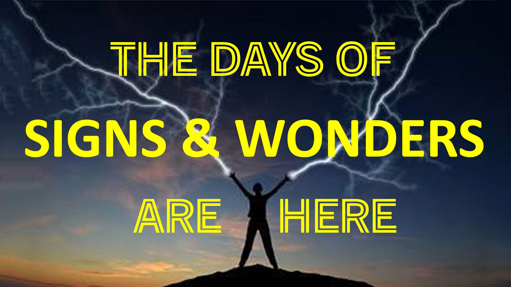

표지판과 불가사의가 가까워졌습니다.

수천 년 전, 표지판과 경이가 국가 및 세계 차원에서 전시되었습니다.

당시 평범한 사람은 물리적 이외의 영역이 있다는 것을 알고있었습니다.

오늘은 그렇지 않습니다.

과학은 깨달음의 시대가 부분적으로 책임이 있다고 말합니다.

깨달음의 무대는 이스라엘 수용소에서 야훼의 영광을 떠나면서 설정되었습니다.

그 출발과 함께, 야훼에 반대하는 신들은 이스라엘과 함께 갔다.

그 신들들은 야훼와의 마지막 전투를 위해 인류를 준비하고 있습니다.

기술 발전은 실제로 그 전투를 준비하고 있습니다.

우리가 과거의 이야기에서 읽은 것처럼, 기술은 실제 전투원 - 신들에게만 전선이 될 것입니다.

신들의 전투로 이어지는 날은 표지판과 불가사의가 각광으로 돌아올 것입니다.