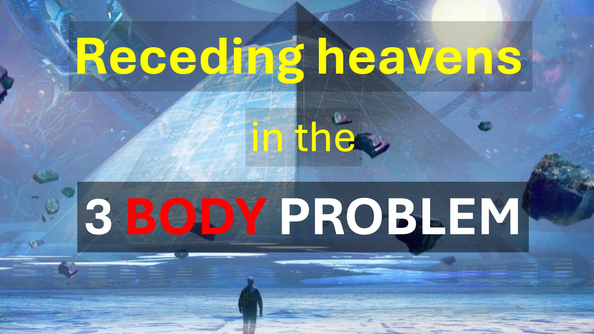

В популярной серии Netflix под названием «Три проблемы тела», небеса отступили, как свиток.

Знаете ли вы, где еще небеса отступили, как свиток?

В Откровении Глава 6 Стих 14 «Небеса отступили как сверкающий свиток».

такие ученые, как Нил Деграсс Тайсон, часто издевается над автором Откровения как невежественного.

Тем не менее, писатель откровения написал то, что он видел, и никогда не утверждал, что понимал это.

хм.

вчера, девственница не могла родить.

сегодня это возможно благодаря искусственному осеменению.

Сегодня невозможно отступить, как свиток.

И все же ученые начинают говорить нам, что мы можем жить в симуляции.

так что завтра, когда небеса отступают, как свиток, это не удивило бы, потому что:

При симуляции небеса могут отступать, как свиток, просто Как написано в Откровении 6 Стих 14.

Узнайте больше

Веб -сайт: http://liveabove3d.com

youtube: https://www.youtube.com/@live .Above.3d

Tiktok: https://www.tiktok.com/@live.above.3d

Twitter: @Live_above_3d https://twitter.com/live_above_3d

reddit: live-above- 3d https://www.reddit.com/user/live-above-3d

instagram: https://www.instagram.com/live.above.3d

facebook: https: //www.facebook .com/profile/100092339087423

Bible stires

Я смотрел, когда он открыл шестую печать. Было большое землетрясение. Солнце стало черным, как уборка, сделанная из козьих волос, целая луна стала красной кровавой, а звезды в небе упали на землю, так как инжир падает с фигового дерева, когда встряхнулась сильным ветром. Небеса отступили, как сверкающий свиток, и каждая гора и остров были удалены с его места.

Откровение 6: 12-142-14