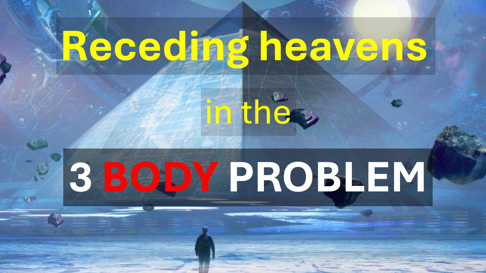

У популярній серії Netflix під назвою: "Три проблеми тіла" небо відступило, як сувій.

Чи знаєте ви, де ще небо відступило, як сувій?

У Об'явленні Розділ 6 Вірш 14, "Небеси відступили, як прокрутка, що котиться".

Вчені, як Ніл ДеГрасс Тайсон, часто знущаються над письменником Об'явлення як невігласом.

Однак письменник Об'явлення написав те, що він бачив, і ніколи не стверджував, що це розуміє.

Хм.

Вчора, незаймана була неможливо народити.

Сьогодні це можливо завдяки штучному заплідненню.

Сьогодні неможливо відступити, як сувій.

Але вчені починають говорити нам, що ми можемо жити в моделюванні. 4 Як написано у Об'явленні 6 Вірш 14.

Дізнайтеся більше

Веб -сайт: http://liveabove3d.com

youtube: https://www.youtube.com/@live .above.3d

tiktok: https://www.tiktok.com/@live.above.3d

Twitter: @live_above_3d https://twitter.com/Live_above_3d

reddit: live-above- 3d https://www.reddit.com/user/live-above-3d

instagram: https://www.instagram.com/live.above.3d

facebook: https: //www.facebook .com/профіль/100092339087423

Вірші Біблії

Я спостерігав, як він відкриває шосту печатку. Був великий землетрус. Сонце перетворилося на чорне, як мішковина, виготовлена ​​з козячого волосся, весь місяць перетворився на кров червоною, а зірки в небі впали на землю, коли інжир падає з смоковника, коли похитнулася сильним вітром. Небо відступило, як прокрутка, що котиться, і кожна гора та острів були вилучені зі свого місця.

Об'явлення 6: 12-142-14