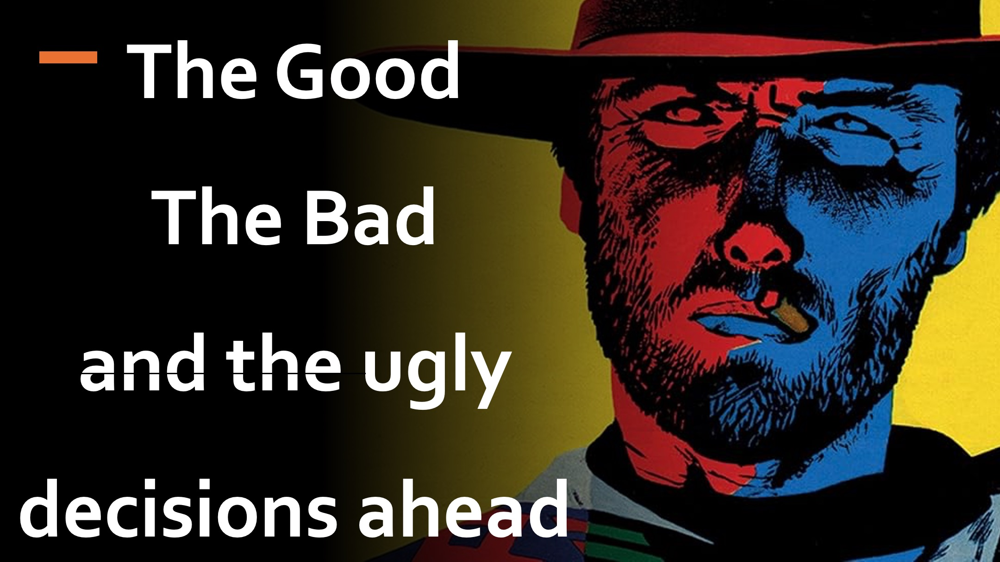

あなたはドイツ軍の長であり、ヒトラーは敵を殺害することで権力を統合する予定だと聞いています。

そのような殺人計画を止めるためには、厳しいカウンターアクションが必要であることを知っています。

あなたのカウンターアクションは、おそらくヒットラーのサポーターの一部を殺すことを含むので、それは価値がなければなりません。 確かに、あなたはためらいます。

しかし、反対側では、ヒトラーは彼の意図を隠し、あなたの決定を覆すように取り組んでいます。

道徳に妨げられていない、悪い人は行動のための偏見を持っていますが、良い人は尋ねることでheします。

バッドの邪悪な行為の影響はどれほど悪いでしょうか？

悪いことに対抗することは私を新しい悪いものにしますか？

うーん

私たちは、悪い人の心を読むことができ、未来を見ることができる善だけで、悪いことに対抗することによって本当に良いことをすることができることを見始めます。

マーク第10章18節がイエスが言った記録を記録します：

「神だけが良い」。

詳細をご覧ください

ウェブサイト：http：//liveabove3d.com

~~ YouTube：https：//www.youtube.com/@live.above.3d ~~

tiktok：https：//www.tiktok.com/@live.above.3d

twitter： @live_above_3d https://twitter.com/live_above_3d

~~ Reddit：live- 3d上記https://www.reddit.com/user/live-above-3d

~~ Instagram：https：//www.instagram.com/live.above.3d

Facebook ：https：//www.facebook.com/profile/100092339087423

聖書の詩

18そしてイエスは彼に言ったのですか？ 良いものはありませんが、1つ、つまり神です。

マーク10:18

17そして彼は彼に言った、なぜあなたは私を良いと呼ぶのですか？ 良いものはありませんが、1つ、つまり神です。しかし、もしあなたが人生に入るなら、戒めを守ってください。

マシュー19:17

ew 19:17