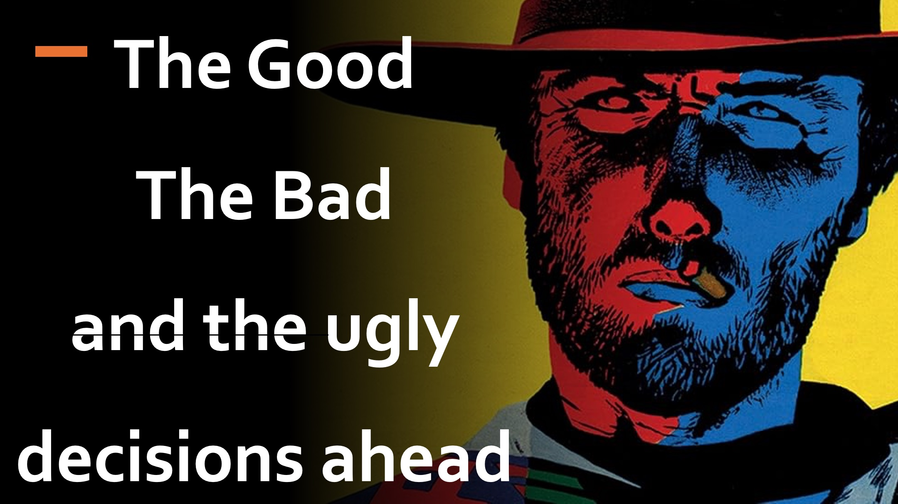

당신은 독일 군대의 수장이며, 히틀러는 상대방을 살해함으로써 권력을 강화할 계획이라고 들었습니다.

당신은 그러한 살인 계획을 중단하기 위해 힘든 카운터 행동이 필요하다는 것을 알고 있습니다.

당신의 반대 행동은 아마도 Hitlers 지지자들을 죽이는 것을 포함 할 것이므로 그만한 가치가 있어야합니다. 그리고 확실하게, 당신은 주저합니다.

그러나 반면에 히틀러는 자신의 의도를 가리고 결정을 전파하기 위해 노력하고 있습니다.

, 당신은 도덕에 의해 방해받지 않고, 나쁜 것은 행동에 대한 편견을 가지고 있으며, 좋은 것은 다음과 같이 물어 보면 주저합니다.

나쁜 악한 행동의 영향은 얼마나 나쁜가?

나에게 나쁜 사람이 나를 새로운 나쁘게 만들까요?

hmm

우리는 악의를 볼 수있을뿐만 아니라 악의를 볼 수있을뿐만 아니라 악의를 반대함으로써 진정으로 선을 볼 수있는 선수만이 진정으로 좋은 일을 할 수 있음을 알기 시작합니다.

놀라운 마크 마크 제 10 장 18 절 예수는 예수가 말씀하신 기록입니다.

자세히 알아보기

웹 사이트 : http://liveabove3d.com

youtube : https://www.youtube.com/@live.above.3d

tiktok : https://www.tiktok.com/@live.above.3d

트위터 : @live_above_3d https://twitter.com/live_above_3d

위의 https://www.reddit.com/user/live-above-3d

Instagram : https://www.instagram.com/live.above.3d

facebook : https://www.ac 좋은 사람은 없습니다. 즉, 신입니다.

마가 복음 10:18

17 17 그리고 그는 그에게 말했다. 좋은 사람은 없습니다.

마태 복음 19:17

ew 19:17