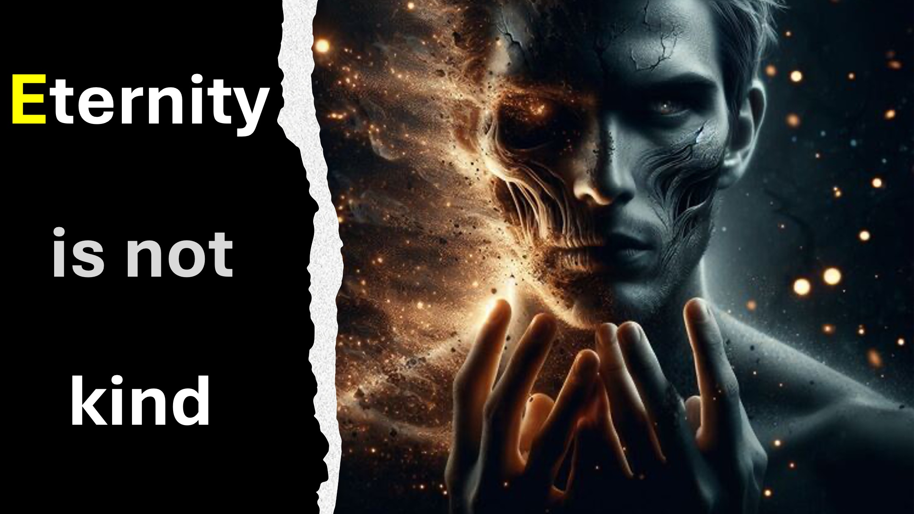

Es ist das Jahr 3001-n.-Chr.;

Pünktlich zur großen Ankündigung erreichen Sie das Elon Musk Zentrum auf dem Mars.

Die Ankündigung ist für Sie keine Überraschung; Schließlich haben Sie das Team geleitet, das erfolgreich das, was Sie den menschlichen Geist und seine Seele nennen, von einem Körper auf einen anderen übertragen hat.

Sie sehen, die Menschen hatten früher gelernt, ihre Jugend auf unbestimmte Zeit aufrechtzuerhalten.

Allerdings hat ein gewaltsamer Tod oft unsere Suche nach ewigem Leben zunichte gemacht.

Mit diesem Durchbruch ist der Tod endgültig besiegt.

Hmm.

Leider müssen sich die Menschen jetzt mit einem neuen Feind auseinandersetzen.

Wir nennen diesen Feind die „Entropie des Bösen“.

Wie bei der Entropie vermehren sich kleine Unvollkommenheiten mit der Zeit (tatsächlich reift das Böse heran).

Menschen, die nicht sterben können, werden immer böser – für immer.

Wussten Sie, dass selbst die kleinste Abweichung von der Liebe unsere Realität mit Hass und Folter erfüllen wird, wenn wir genügend Zeit haben?

Nenn es einfach die Hölle.

Habt ihr dafür eine Lösung?

ERFAHREN SIE MEHR

Website: http://liveabove3d.com

Youtube: https://www.youtube.com/ @live.above.3d

Tiktok: https://www.tiktok.com/@live.above.3d

Twitter: @live_above_3d https://twitter.com/live_above_3d

Reddit: live-above-3d https://www.reddit.com/user/live-above-3d

u~ ~~u Instagram: https://www.instagram.com/live.above.3d/

Facebook: https://www.facebook.com/profile.php?id=100092339087423