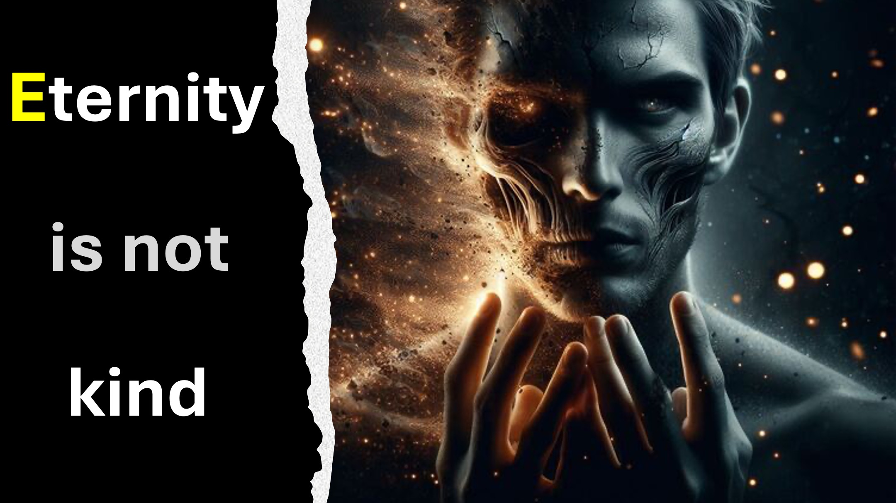

这是公元3001年； 您正好赶到火星上的埃隆·马斯克中心（Elon Musk Center），及时宣布。

公告对您来说并不奇怪。 毕竟，您领导了成功将您所谓的人类精神及其灵魂转移到另一个身体的团队。

您看到，人类早些时候学会了无限期地维持青年。

但是，暴力死亡经常截断了我们对永恒生活的追求。

随着这一突破，死亡终于被征服了。

嗯。

不幸的是，人类现在必须与新敌人斗争。

我们将这个敌人称为：“邪恶的熵”。

与熵一样，很少的瑕疵随着时间的流逝而扩散（实际上是邪恶的）。

不能死的人将变得越来越邪恶 - 永恒。

您知道，如果有足够的时间，即使是爱的丝毫偏离也会充满仇恨和酷刑。

只要称呼地狱。

您有解决方案吗？

了解更多

网站：http：//liveabove3d.com

youtube：https：//www.youtube.com/@live.above.3d

tiktok：https：//www.tiktok 。 -3d

instagram：https：//www.instagram.com/live.above.3d

facebook：https：//www.facebook.com/profile/10009239087423

