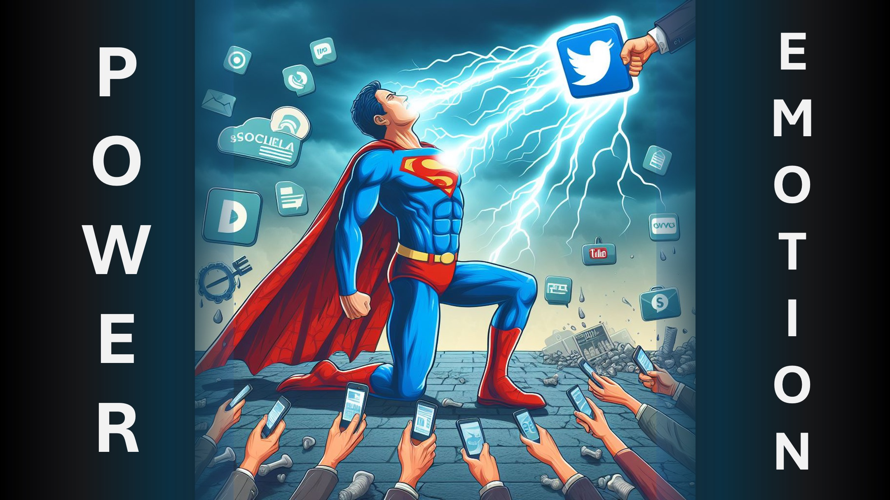

¿Alguna vez has visto un nuevo superhéroe luchando por controlar su poder?

Ese tipo de poder suele ser de poco uso, ya que aparece cuando uno menos espera y se va tal como llegó.

Así es básicamente como son la mayoría de los cristianos.

Hoy revelaré un secreto que te ayudará a canalizar adecuadamente el poder de Dios en ti.

El poder viene por la fe y la fe viene al escuchar la verdad, es decir, la Palabra de Dios.

Sin embargo, los humanos han trivializado palabras.

Películas, libros ficticios, chistes, redes sociales, incluso las noticias se basan en alguna forma de engaño.

Cuando escuchas estos y tocan tu emoción, les estás permitiendo controlarte.

De hecho, estás enviando algo de control.

que el control debe reservarse para la Palabra de Dios.

¿Qué debes hacer?

Disminuya cualquier otra fuente de información a medida que aumenta la Palabra de Dios en su vida.

Aprenda más

Sitio web: http://liveBove3d.com

YouTube: https://www.youtube.com/@live.above.3d

tiktok: https://www.tiktok.com/@live.above.3d

twitter: @live_above_3d https://twitter.com/live_above_3d

reddit: live-- arriba-3d https://www.reddit.com/user/live-above-3d

Instagram: https://www.instagram.com/live.above.3d

Facebook : https://www.facebook.com/profile/100092339087423

423