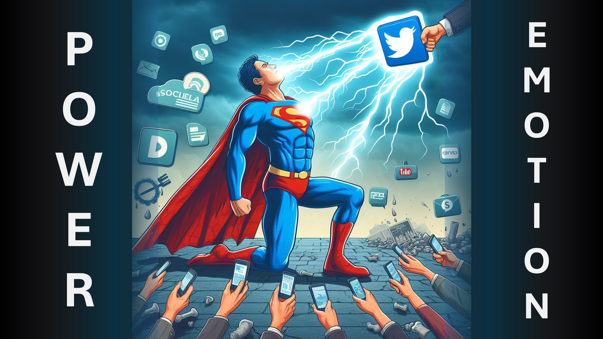

Avez-vous déjà vu un nouveau super-héros avoir du mal à contrôler leur pouvoir?

Ce type de pouvoir est généralement peu utile car il s'allume quand on s'attend le moins et part au tel qu'il est venu.

C'est essentiellement à quel point la plupart des chrétiens sont.

Aujourd'hui, je vais révéler un secret qui vous aidera à canaliser correctement la puissance de Dieu en vous.

Le pouvoir vient par la foi et la foi vient en entendant la vérité, c'est-à-dire la parole de Dieu.

Cependant, les humains ont banalisé des mots.

Films, livres de fiction, blagues, médias sociaux, même les nouvelles sont toutes construites sur une forme de tromperie.

Lorsque vous les écoutez et qu'ils touchent votre émotion, vous leur permettez de vous contrôler.

En effet, vous soumettez un certain contrôle.

Ce contrôle doit être réservé à la parole de Dieu.

Que devez-vous faire?

Diminuez toutes les autres sources d'informations lorsque vous augmentez la parole de Dieu dans votre vie.

En savoir plus

Site Web: http://liveabove3d.com

YouTube: https://www.youtube.com/@live.above.3d

Tiktok: https://www.tiktok.com/@live.above.3d

Twitter: @ live_above_3d https://twitter.com/Live_above_3d

Reddit: Live- ci-dessus-3d https://www.reddit.com/user/live-above-3d

Instagram: https://www.instagram.com/live.above.3d

Facebook : https://www.facebook.com/profile/100092339087423

423