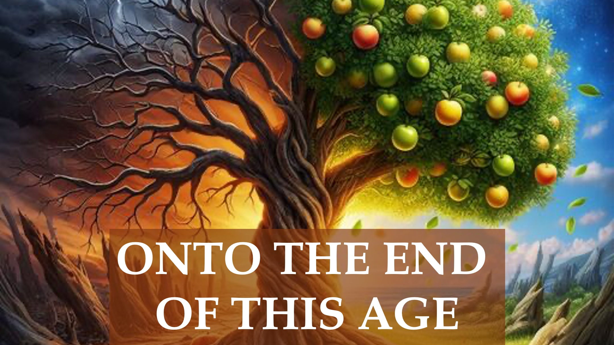

Wer wird in den Himmel kommen?

Was ist mit der Verzückung?

Hierzu sagte Jesus in Johannes 15:6, dass unfruchtbare Christen ins Feuer geworfen würden.

Was viele nicht wissen ist, dass unsere Früchte faul sind, wenn sie nicht von Gott inspiriert sind.

Tatsächlich offenbart 1. Korinther 3:13, dass Feuer die Arbeit eines jeden Menschen auf die Probe stellen wird.

Jesus offenbart in Matthäus 7 auch, dass er einige „fruchtbringende“ Christen ablehnen wird.

Also; Es ist wichtig zu wissen, ob Ihre Früchte gut sind.

Dazu sagte Jesus, dass fruchttragende Christen gereinigt werden, um mehr Frucht zu bringen.

Gute Frucht führt also zu einer Steigerung im Leben eines Christen.

Nicht eine Vermehrung materieller Dinge, sondern eine Vermehrung derselben Fähigkeit, die gute Früchte hervorbrachte.

Kein Wunder, dass Sprüche 4:18 besagt, dass der Gerechte mit der Zeit heller strahlt.

Sie sehen, es kommt nicht auf das Niveau an, auf dem Sie sich befinden, sondern darauf, ob Sie sich steigern.

Hmm.

Du solltest zunehmen; wenn die Trompete erklingt.

BIBELVERSE

5 Ich bin der Weinstock, ihr seid die Reben. Wer in mir bleibt, und ich in ihm, der bringt viel Frucht hervor; denn Ohne mich könnt ihr nichts tun.

6 Wenn jemand nicht in mir bleibt, wird er weggeworfen wie eine Rebe und verdorrt; Und die Menschen sammelten sie und warfen sie ins Feuer, und sie verbrannten.

7 Wenn ihr in mir bleibt und meine Worte in euch bleiben, werdet ihr bitten, was ihr wollt, und es wird euch geschehen.

8 Hierin wird mein Vater verherrlicht, dass ihr viel Frucht bringt; So werdet ihr meine Jünger sein.

Johannes 15:5-8

13 Das Werk eines jeden Menschen wird offenbar werden; denn der Tag wird es verkünden, denn es wird im Feuer offenbar werden; und das Feuer wird die Arbeit jedes Menschen auf die Probe stellen, welcher Art sie auch ist.

1. Korinther 3:13

22 Viele werden an jenem Tag zu mir sagen: Herr, Herr, haben wir nicht in deinem Namen geweissagt? und hast in deinem Namen Teufel ausgetrieben? und in deinem Namen viele wunderbare Werke getan?

23 Und dann werde ich ihnen bekennen: Ich habe euch nie gekannt: Weicht von mir, ihr, die ihr Unrecht tut.

Matthäus 7:22-23

1 Ich bin der wahre Weinstock, und mein Vater ist der Weingärtner.

2 Jede Rebe an mir, die keine Frucht bringt, schneidet er weg; und jede Rebe, die Frucht bringt, reinigt er, damit sie mehr Frucht bringe.

1. Johannes 15:1-2

18 Aber der Weg des Gerechten ist wie das strahlende Licht, das immer heller leuchtet bis zum vollkommenen Tag.

Sprüche 4:18

ERFAHREN SIE MEHR

Website: http://liveabove3d.com

u~~~ u Youtube: https://www.youtube.com/@live.above.3d

Tiktok: https://www.tiktok.com/@live.above.3d

Twitter: @live_above_3d https://twitter.com/live_above_3d

Reddit: live-above-3d https://www.reddit.com/user/ live-above-3d

Instagram: https://www.instagram.com/live.above.3d/

Facebook: https://www.facebook.com/profile.php?id=100092339087423

TITELBILD

https://designer. microsoft.com/image-creator

Eingabeaufforderung: „Ein Baum, mit einer dunklen, faulen und fruchtlosen Hälfte sowie einer beleuchteten, herrlichen und fruchtbaren anderen Hälfte“

ed, glorreiche und fruchtbare andere Hälfte“