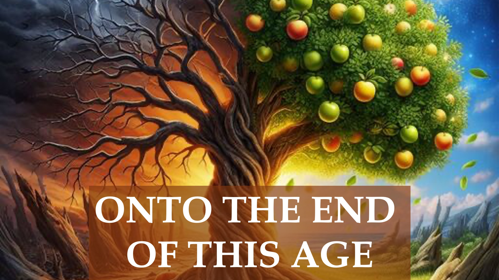

誰が天国に入るのですか？

歓喜はどうですか？

これに関して、ヨハネ15：6のイエスは、実りのないクリスチャンが火に投げ込まれると言いました。

多くの人が知らないのは、神に触発されていないなら、私たちの果物が腐っているということです。

実際、1コリント3:13は、火がすべての人の仕事を試みることを明らかにしています。

イエスはまた、マシュー7で、「果物生産」クリスチャンを拒否することを明らかにしています。

そう; あなたの果物が良いかどうかを知ることが重要です。

それに対して、イエスは、クリスチャンを産む果物がより多くの果物を産むように浄化されると言った。

だから、良い果物はクリスチャンの生活の増加を生み出します。

物質的なものの増加ではなく、良い果物を生み出したのと同じ能力の増加。

Pro言4:18は、義人が時間とともに明るく輝くと言っているのも不思議ではありません。

ご覧のとおり、それはあなたが重要なレベルではなく、あなたが増加しているかどうかです。

うーん。

あなたは増加するはずです。 トランペットが鳴るとき。

聖書の詩

5私はつるです、あなたはあなたがたは枝です：彼は私の中にいます、そして私は彼の中に、同じことが多くの実をもたらします：私なしではあなたがたは何もできません 。

6男が私の中にいない場合、彼は枝として出され、枯れている。 そして、男性はそれらを集めて火の中に投げ込み、彼らは火傷します。

7あなたがたが私に順守し、私の言葉があなたにとどまるならば、あなたがたはあなたがたまらに尋ねるなら、それはあなたに行われるでしょう。

8ここで私の父は栄光を与えています、あなたがたは多くの実を持っています。 だからあなたがたは私の弟子であるでしょう。

ヨハネ15：5-8

 13すべての人の作品は明らかになります。 そして、火はそれがどんな種類であるかのすべての人の仕事を試みます。

1コリント人への手紙3:13

22その日、主よ、私はあなたの名前で預言されていませんか？ そして、あなたの名前で悪魔を追い出しましたか？ そして、あなたの名前で多くの素晴らしい作品をしましたか？

23そして、私は彼らに公言します、私はあなたを知らなかった：私から出発して、あなたがたはその不法に働きます。

Mathew 7：22-23

1私は本当のつるであり、父は夫です。

2私の中のすべての枝は、彼が追い払う果物ではなく、果物を担います。

1ヨハネ15：1-2

18しかし、公正な道は輝く光のように、それはますます完璧な日まで輝きます。

Pro言4:18

もっと学ぶ

ウェブサイト：http：//liveabove3d.com

 YouTube：https：//www.youtube.com /@@live.above.3d

tiktok：https：//www.tiktok.com/@live.above.3d

twitter：@live_above_3d https://twitter.com/live_above_3d

reddit：live-above-3d https://www.reddit.com/user/live-above-3d

Instagram：https：//www.instagram.com/live。 上記。3d

Facebook：https：//www.facebook.com/profile/100092339087423

カバー画像

https://designer.microsoft.com/image- 作成者

プロンプト：「暗く、腐った、実りのない半分、照らされた、輝かしい、実り多い半分を備えた木」

ed、栄光で実りある他の半分」