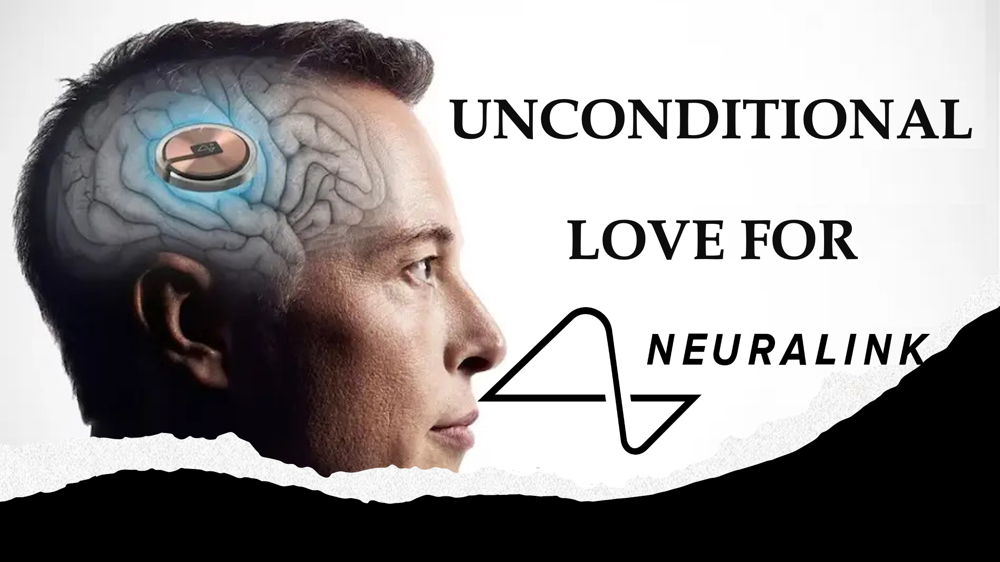

Is God’s love unconditional?

Let’s see.

It’s 2034 and the last of humans are eking out a survival on Mars, after our kind made the earth desolate.

To survive, humankind needs a knowledge boost, and many believe that this could be provided by Elon Musk’s Neuralink brain implant.

The first version of Neuralink helped people with certain disabilities control things with their minds. 

Later versions made even high school dropouts as knowledgeable as top Astro Physicists.

This led to a caste system where only those with Neuralink got good jobs.

Fortunately, Elon Musk decided to offer Neuralink unconditionally and for free.

Unfortunately, many signed the offer, but chickened out when it was time to implant Neuralink to their brain.

They chickened out because knowledge generally comes with expectations of certain virtues; like mentorship and stewardship.

Hmm.

Our story is really about God’s offer of love.

From what you heard, is it unconditional?

LEARN MORE

Website: http://liveabove3d.com

Youtube: https://www.youtube.com/@live.above.3d

Tiktok: https://www.tiktok.com/@live.above.3d

Twitter: @live_above_3d https://twitter.com/live_above_3d

Reddit: live-above-3d https://www.reddit.com/user/live-above-3d

Instagram: https://www.instagram.com/live.above.3d

Facebook: https://www.facebook.com/profile/100092339087423
423
