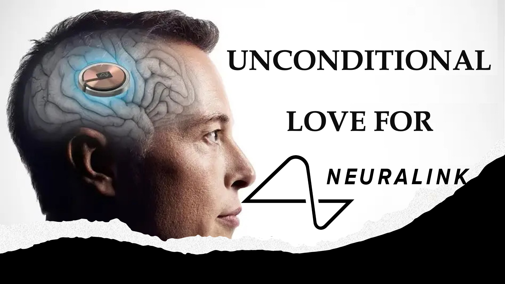

क्या भगवान का प्रेम बिना शर्त है?

आइए देखें।

यह 2034 है और मनुष्यों के अंतिम मंगल पर एक अस्तित्व को बाहर निकाल रहे हैं, क्योंकि हमारी तरह ने पृथ्वी को उजाड़ दिया था।

जीवित रहने के लिए, मानव जाति को एक ज्ञान को बढ़ावा देने की आवश्यकता है, और कई लोग मानते हैं कि यह एलोन मस्क के न्यूरलिंक ब्रेन इम्प्लांट द्वारा प्रदान किया जा सकता है।

न्यूरलिंक के पहले संस्करण ने कुछ विकलांग लोगों को अपने दिमाग के साथ चीजों को नियंत्रित करने में मदद की।

बाद के संस्करणों ने शीर्ष एस्ट्रो भौतिकविदों के रूप में जानकार के रूप में भी हाई स्कूल ड्रॉपआउट किया।

इसने एक जाति व्यवस्था का नेतृत्व किया, जहां केवल न्यूरलिंक वाले लोगों को अच्छी नौकरियां मिलीं।

सौभाग्य से, एलोन मस्क ने बिना शर्त और मुफ्त में न्यूरलिंक की पेशकश करने का फैसला किया।

दुर्भाग्य से, कई लोगों ने प्रस्ताव पर हस्ताक्षर किए, लेकिन जब यह उनके मस्तिष्क को न्यूरलिंक को प्रत्यारोपित करने का समय था, तब बाहर निकला।

वे बाहर निकले क्योंकि ज्ञान आम तौर पर कुछ गुणों की अपेक्षाओं के साथ आता है; मेंटरशिप और स्टूवर्डशिप की तरह।

हम्म।

हमारी कहानी वास्तव में भगवान के प्यार की पेशकश के बारे में है।

जो आपने सुना, क्या यह बिना शर्त है?

और जानें

वेबसाइट: http://liveabove3d.com

youtube: https://www.youtube.com/@live.above.3d

tiktok: https://www.tiktok.com/@live.above.3d

ट्विटर: @live_above_3d https://twitter.com/live_above_3d

reddit: live- ऊपर -3d https://www.reddit.com/user/live-above-3d

Instagram: https://www.instagram.com/live.above.3d

फेसबुक : https://www.facebook.com/profile/100092339087423

423