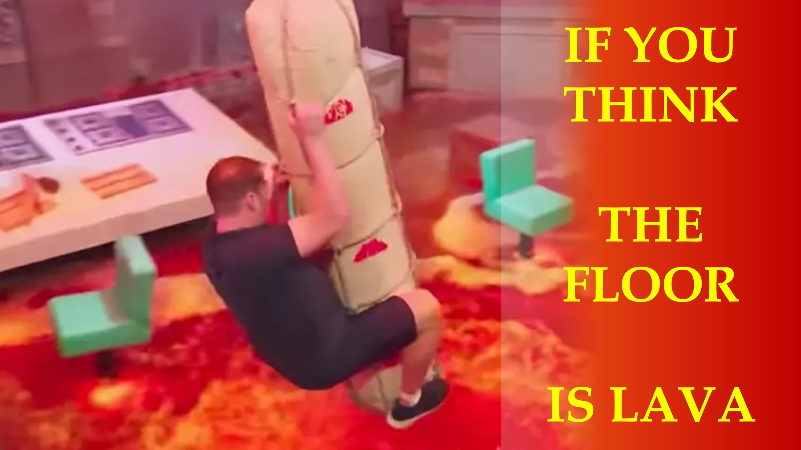

إذا كنت تعتقد أن الأرضية هي الحمم البركانية ، عندما تكون مجرد خشب ، فسيتم تقييد سلوكك بالكذب في ذهنك.

أنت لست حرًا ؛ للتجول بحرية.

اللحظة التي تعرف فيها الحقيقة ؛ لن يتأثر سلوكك بالكذب.

الحقيقة يجب أن تجعلك حرة - جون الفصل 8 الآية 32.

ماذا عن الإيمان؟

هم.

سوع الطين الموضوعة قبل أن يلقي المصباح الكهربائي بظلاله.

يقول الكتاب المقدس أن الله هو المصباح الكهربائي وكلمته هي النور.

هذا العالم المادي هو الظل.

وعاء الطين هو مادة روح. في البعد الرابع.

تعرف هذا ؛ البعد الرابع أكثر واقعية من عالمنا المادي.

أنت - ظل - سيكون لديك إيمان عندما تعلم ، أن مادة الروح - هذه هي المادة الحقيقية - لما تريد ؛ موجود.

كيف يمكن أن يحدث هذا؟

كيف يمكننا الاستفادة من البعد الرابع؟

اسمحوا لي أن أعرف ما هو رأيك في قسم التعليقات.

تعرف على المزيد

الموقع الإلكتروني:

tiktok: https://www.tiktok.com/@live.above.3d

twitter: @live_above_3d https://twitter.com/live_above_3d

reddit: live- أعلاه-3d https://www.reddit.com/user/live-above-3d

instagram: https://www.instagram.com/live.above.3d

facebook : https://www.facebook.com/profile/100092339087423

087423