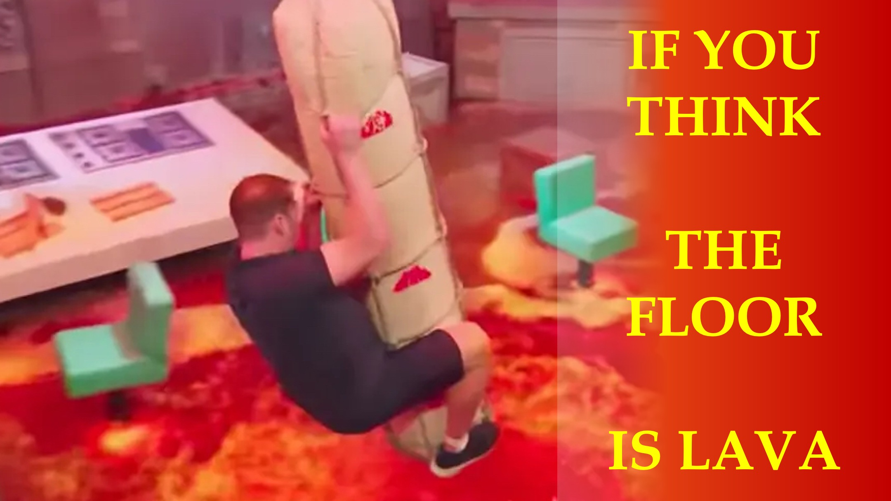

यदि आपको लगता है कि फर्श लावा है, जब यह सिर्फ लकड़ी है, तो आपका व्यवहार आपके दिमाग में झूठ द्वारा प्रतिबंधित हो जाएगा।

आप स्वतंत्र नहीं हैं; घूमने के लिए; स्वतंत्र रूप से।

जिस क्षण आप सत्य को जानते हैं; आपका व्यवहार अब झूठ से प्रभावित नहीं होगा।

सत्य आपको मुक्त कर देगा - जॉन अध्याय 8 कविता 32।

विश्वास के बारे में क्या?

हम्म।

एक लाइट बल्ब से पहले रखा गया एक मिट्टी का बर्तन छाया डालेगा।

बाइबल कहती है कि ईश्वर प्रकाश बल्ब है और उसका वचन प्रकाश है।

यह भौतिक दुनिया छाया है।

मिट्टी का बर्तन आत्मा पदार्थ है; चौथे आयाम में।

यह पता है; चौथा आयाम हमारी भौतिक दुनिया की तुलना में अधिक वास्तविक है।

आप - एक छाया - जब आप जानते हैं तो विश्वास होगा, कि आत्मा पदार्थ - यह वास्तविक पदार्थ है - जो आप चाहते हैं; मौजूद है।

यह कैसे हो सकता है?

हम चौथे आयाम में कैसे टैप कर सकते हैं?

मुझे बताएं कि आप टिप्पणी अनुभाग में क्या सोचते हैं।

और जानें

वेबसाइट: http://liveabove3d.com

youtube: https://www.youtube.com/@live.above.3d

tiktok: https://www.tiktok.com/@live.above.3d

ट्विटर: @live_above_3d https://twitter.com/live_above_3d

reddit: live- ऊपर -3d https://www.reddit.com/user/live-above-3d

Instagram: https://www.instagram.com/live.above.3d

फेसबुक : https://www.facebook.com/profile/100092339087423

087423