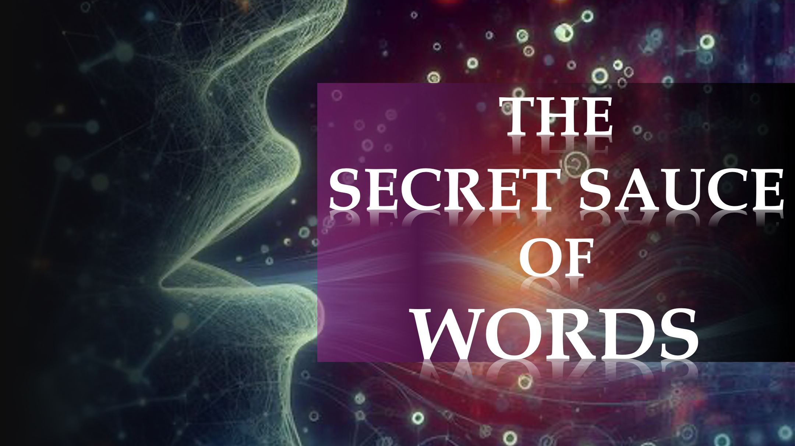

Les particules dont vous êtes composées pèsent moins de 5% de votre poids total.

Qu'en est-il des 95% restants de votre poids?

Les 95% restants proviennent de l'énergie de ces mêmes particules.

Une façon fantaisie de dire que cela est: "Nous sommes faits d'énergie."

Pas étonnant que Nikola Tesla a dit:

"Si vous voulez trouver les secrets de l'univers, pensez en termes d'énergie, de fréquence et de vibration."

Sans surprise, des milliers d'années avant Tesla, la Bible dans Hébreux 11: 3 a enregistré que:

«Des choses qui sont vues n'étaient pas faites de choses qui apparaissent».

Il explique cela en disant:

«L'univers et ses époques ont été encadrés par la Parole de Dieu.»

Une façon fantaisie de dire que cela est: «Les mots peuvent créer de la matière.»

Hmm.

Nous ne voyons pas les gens créer des choses avec des mots, dans notre vie quotidienne.

Il doit donc y avoir quelque chose qui ne va pas avec nos paroles.

Dans la partie suivante, nous découvrirons la sauce secrète de mots.

Versets bibliques

Par la foi, nous comprenons que les mondes étaient encadrés par la Parole de Dieu, de sorte que les choses qui sont vues n'étaient pas faites de choses qui apparaissent.

Hébreux 11: 3

En savoir plus

Site Web: http://liveabove3d.com

YouTube: https://www.youtube.com /@live.above.3d

tiktok: https://www.tiktok.com/@live.above.3d

Twitter: @ live_above_3d https://twitter.com/live_above_3d

reddit: live-above-3d https://www.reddit.com/user/live-above-3d

Instagram: https://www.instagram.com/live. ci-dessus.3d

Facebook: https://www.facebook.com/profile/100092339087423

092339087423