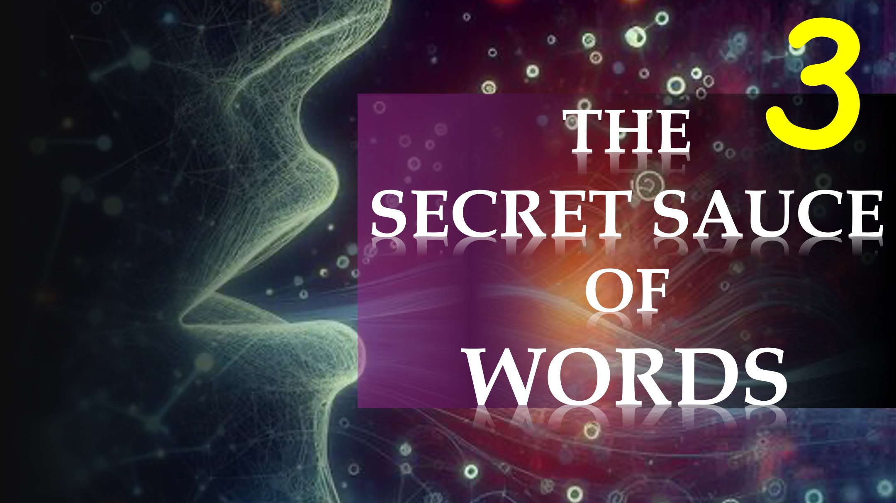

以前、私たちは、第4次元の現実を知っているときに信仰が来ることを示しました。

第4次元にどのように注意することができますか。 または精神の領域。

うーん。

それは書かれています、そして今私は言います：

「信仰は神の言葉を聞くことによって来ます」 - ローマ人への手紙10：17a

 神様？

それは書かれています、そして今私は言います：

「神の言葉を聞いて、神の言葉によって来る」 - ローマ10：17b。

今あなたはそれを持っています。

あなたは神の言葉を聞くことによって信仰を得る。

あなたは神の言葉を聞きます - 神の言葉によって。

神の言葉についてのすべて。

昔々、知恵が主なものでした -  Pro言4：7a。

それから神の言葉が来ました：

「ソロモンよりも大きいです」 - マタイ12：42b。

世界はイーロン・マスクのような人の知恵に驚嘆している間、あなたは神の言葉が明らかにするものによって生きるべきです。

私たちの最後の部分では、私たちは神を聞き、信仰によって生きるための実用的なヒントを与えます。

聖書の詩

それから、信仰は聞いて、神の言葉で聞くことによって登場します。

ローマ人10:17

知恵は主要なものです。 したがって、知恵を得る：そして、あなたのすべてのことを理解することで。

Pro言4：7

南部の女王はこの世代とともに判断で立ち上がって、それを非難します。 ソロモンの; そして、見よ、ソロモンよりも大きいです。

マシュー12:42。

詳細をご覧ください

ウェブサイト：http：//liveabove3d.com

 YouTube：https：//www.youtube.com/@live.above.3d 

tiktok：https：//www.tiktok.com/@live.above.3d

twitter： @live_above_3d https://twitter.com/live_above_3d

 Reddit：live- 3d上記https://www.reddit.com/user/live-above-3d

 Instagram：https：//www.instagram.com/live.above.3d

Facebook ：https：//www.facebook.com/profile/100092339087423

e.php？id = 100092339087423