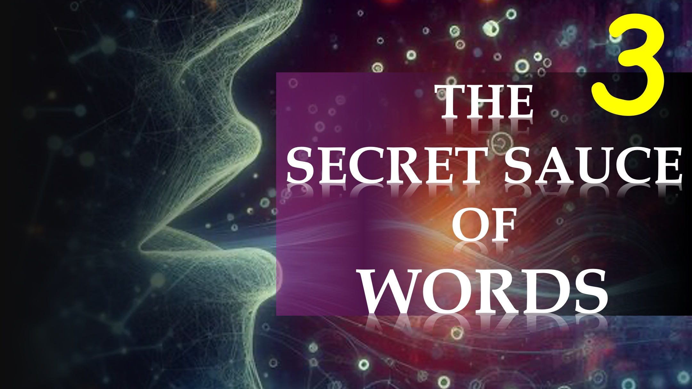

Ранее мы показали, что вера приходит, когда мы осознаем реальность в четвертом измерении.

Как мы можем знать о четвертом измерении; или духовное царство.

хм.

это написано, и теперь я говорю:

«Вера приходит, услышав Слово Божье» - Римлянам 10: 17a

Итак, как вы можете слышать слово Бог?

 

теперь у вас есть.

Вы получаете веру, услышав Слово Божье.

Вы слышите Слово Божье - по Слову Божьему.

Это все о Словом Божьем.

Однажды, мудрость была главной вещью - Притчи 4: 7a.

Затем появилось слово Божье, сказав:

«Больше Соломона здесь» - Матфея 12: 42b.

В то время как мир восхищается мудростью людей, таких как Элон Маск, вы должны жить по тому, что говорит Слово Божье.

В нашей последней части мы даем практические советы, чтобы услышать Бога и жить верой.

Библейские стихи

Итак, тогда вера прилегает услышан и слышит Словом Божьим.

Римлянам 10:17

Мудрость - главная вещь; Поэтому получите мудрость: и со всеми, кто получайте понимание.

Притчи 4: 7

Соломона; И вот, здесь больше, чем Соломон.

Мэтью 12:42.

Веб -сайт: http://liveabove3d.com

youtube: https://www.youtube.com/@live.above.3d

Tiktok: https://www.tiktok.com/@live.above.3d

Twitter: @Live_above_3d https://twitter.com/live_above_3d

Reddit: Live- Выше-3d https://www.reddit.com/user/live-above-3d

instagram: https://www.instagram.com/live.above.3d

Facebook : https://www.facebook.com/profile/100092339087423

e.php? ID = 100092339087423