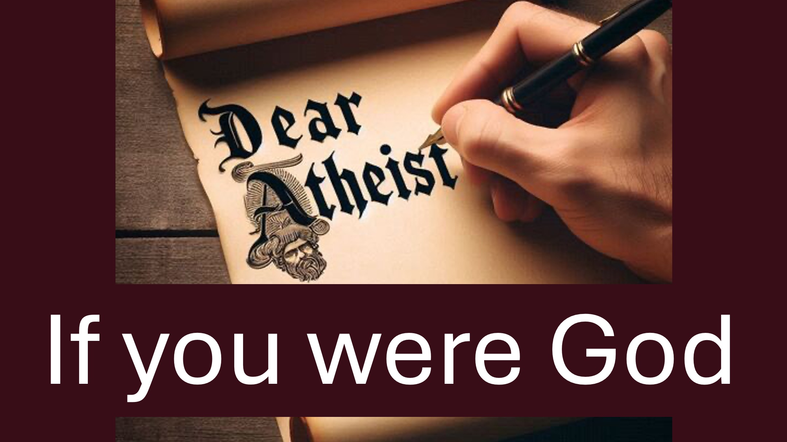

Cher athée.

Comment prouveriez-vous que vous existez - si vous étiez Dieu?

Voici la chose.

Bientôt, l'intelligence artificielle pensera comme les humains.

Les personnages du jeu vidéo (souvent appelés avatars); Pensera aussi comme des humains.

Comme les humains, ces avatars se poseront des questions comme:

y a-t-il un créateur intelligent?

Pourquoi nos créateurs ne se montreraient-ils pas?

Si vous étiez le créateur d'un tel jeu vidéo; Comment prouveriez-vous que vous existez?

Hmm.

Eh bien; Un humain prétendait être l'avatar; l'icône; l'image de notre créateur.

Ses croyants l'appelaient Jésus, l'oint, le Sauveur.

Il a dit que tous ceux qui croyaient en lui recevraient l'esprit de notre créateur.

Il a également dit que l'Esprit donne aux croyants le pouvoir de prouver l'existence de notre Créateur.

j'aime la façon dont Dieu a choisi de prouver son existence.

Plutôt que d'interférer en permanence avec les humains, Dieu a mis sa puissance à notre disposition.

Que pensez-vous?

Faites-moi savoir dans la section des commentaires.

Versets bibliques

8 Philip lui a dit: "Seigneur, montre-nous le Père, et c'est suffisant pour nous." 9 Jésus lui a dit: «Ai-je été avec toi si longtemps, et tu ne me connais toujours pas, Philip? Celui qui m'a vu a vu le père. Comment pouvez-vous dire «Montrez-nous le père»? 10 Ne croyez-vous pas que je suis dans le père et le père est en moi? Les mots que je vous dis, je ne parle pas de ma propre autorité, mais le père qui habite en moi fait ses œuvres. 11 croyez-moi que je suis dans le père et que le père est en moi, ou bien croire en raison des œuvres elles-mêmes.

12 «Vraiment, vraiment, je vous dis, quiconque croit en moi fera également les œuvres que je fais; Et de plus grandes œuvres que celles-ci le feront, parce que je vais chez le père. 13 Tout ce que vous demandez en mon nom, je ferai que le père peut être glorifié dans le fils. 14 Si vous me demandez [e] quoi que ce soit en mon nom, je le ferai.

Jean 14: 8-14

... vous recevrez le pouvoir, après que le Saint-Esprit soit venu sur vous: et vous serez mes témoins à Jérusalem, dans toute la Judée, en Samarie, et jusqu'aux extrémités de la terre.

Actes 1: 8

En savoir plus

Site Web: Liveabove3d.com

YouTube: www.youtube.com/@live.above.3d  

tiktok: www.tiktok.com/@live.above.3d

Twitter: @ live_above_3d twitter.com/Live_above_3d

reddit: live-above-3d www.reddit .com / user / live-above-3d

Instagram: www.instagram.com/live.above.3d

Facebook: /www.facebook.com/profile/100092339087423

#Dearatheist #Challenge #Christian #faith #apologétique #atheist

# liveAbove3d #god #Jesus #ChristianapoGoroUtic Dieu #UnderstandingChristianity #Faithvsscience #seekingtruth #LogicAndBelief # christianity101 #questioningatheism #DeBunkingMyths #GodandScience #DiscoveringFaith #ChristianLiv  @ DailyDoseofwisdom