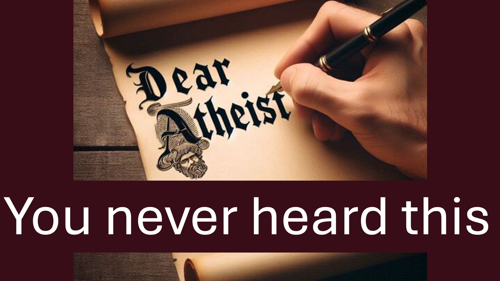

#dearatheist #challenge #christian #faith #apologetics #atheist

Dear Atheist.

Do not ask God to show Himself.

Rather, ask Christians to display the power of God.

That’s how the bible says Christians should prove God.

Here’s the thing.

There are Christians who display the power of God by healing the sick and freeing humans from all types of problems.

However, you may not hear of these Christians because:

One - There are many fakes.

Two - You prefer business, politics, or comedy; and the internet shows you what you prefer.

However, there’s good news.

The bible makes it clear that God is fair.

God gives every human the chance they need, to know Him.

Have you overlooked your chance?

Hmmm.

That one time you briefly saw a video; or you read a headline that seemed to show someone displaying the power of God.

Then - God was reaching out to you.

Now - God is reaching out to you again to: “do some research about what you have just heard”.

The most important research of your life.

BIBLE VERSES

...You shall receive power, after that the Holy Ghost is come upon you: and you shall be my witnesses in Jerusalem, in all Judaea, in Samaria, and up to the ends of the earth.

Acts 1:8

…I, the Lord, love justice; I hate roberry and wrongdoing.

Isaiah 61:8

The Lord … is patient with you, not wanting anyone to perish, but everyone to repent.

2 Peter 3:9

LEARN MORE

Website: liveabove3d.com

YouTube: www.youtube.com/@live.above.3d

TikTok: www.tiktok.com/@live.above.3d

Twitter: @live_above_3d twitter.com/live_above_3d

Reddit: live-above-3d www.reddit.com/user/live-above-3d

Instagram: www.instagram.com/live.above.3d/

Facebook: /www.facebook.com/profile.php?id=100092339087423

#viral #foryou #LiveAbove3D #god #jesus #ChristianApologetics #LoveOfGod #FaithAndReason #TruthInChristianity #ScienceAndFaith #ChristianityExplained #BelieveInJesus #ReasonsForFaith #EvidenceForGod #UnderstandingChristianity #FaithVsScience #SeekingTruth #LogicAndBelief #Christianity101 #QuestioningAtheism #DebunkingMyths #GodAndScience #DiscoveringFaith #christianliving #blessed #hope #inspiration #BeyondThePhysical

@LiveAbove3D @samshamoun @dailydoseofwisdom @Empathetic_Mindfulness @SpaceRewind @technoplusmedia @Cosmoknowledge @themessagechannel1 @CuriositySp @veritasium @kapchatfield.07 @ken.arrington @tedtoks @the.anonymous.prophetngton @tedtoks @the.anonymous.prophet