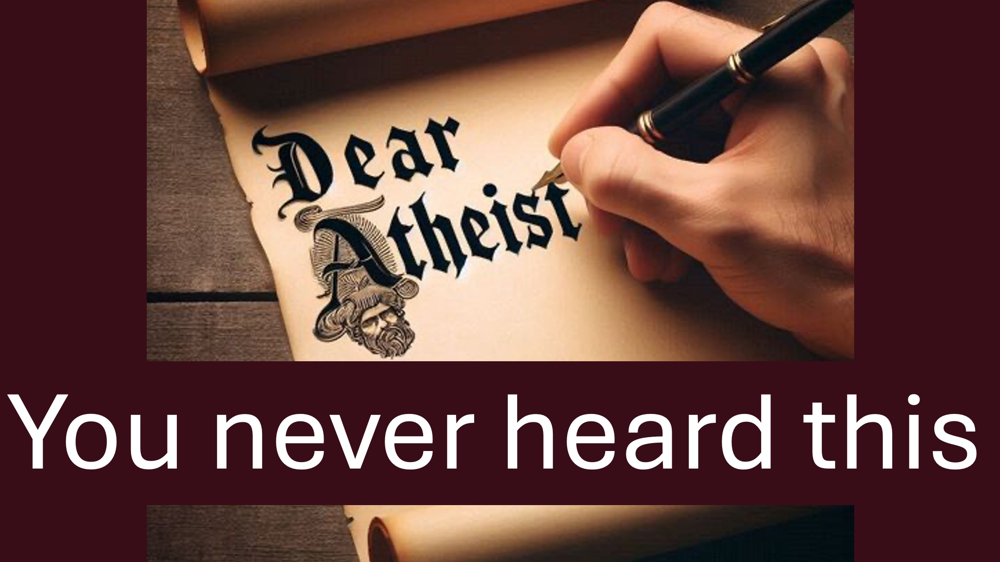

#dearatheist #challenge #christian #faith #apologetics #atheist

Lieber Atheist.

Bitten Sie Gott nicht, sich zu zeigen.

Bitten Sie die Christen vielmehr, die Macht Gottes zu zeigen.

So sagt die Bibel, dass Christen Gott beweisen sollten.

Hier ist die Sache.

Es gibt Christen, die die Macht Gottes zeigen, indem sie Kranke heilen und Menschen von allen Arten von Problemen befreien.

Möglicherweise hören Sie jedoch nichts von diesen Christen, weil:

Eins – Es gibt viele Fälschungen.

Zwei – Sie bevorzugen Wirtschaft, Politik oder Komödie; und das Internet zeigt Ihnen, was Sie bevorzugen.

Es gibt jedoch gute Neuigkeiten.

Die Bibel macht deutlich, dass Gott gerecht ist.

Gott gibt jedem Menschen die Chance, die er braucht, Ihn kennenzulernen.

Hast du deine Chance verpasst?

Hmmm.

Das eine Mal hast du kurz ein Video gesehen; oder Sie haben eine Überschrift gelesen, in der es den Anschein hat, als würde jemand die Macht Gottes zur Schau stellen.

Dann – Gott hat sich an dich gewandt.

Nun – Gott wendet sich erneut an Sie, um „einige Nachforschungen über das anzustellen, was Sie gerade gehört haben“.

Die wichtigste Forschung Ihres Lebens.

BIBELVERSE

...Ihr werdet Kraft empfangen, nachdem der Heilige Geist über euch gekommen ist, und ihr werdet meine Zeugen in Jerusalem sein , in ganz Judäa, in Samaria und bis an die Enden der Erde.

Apostelgeschichte 1:8

…Ich, der Herr, liebe die Gerechtigkeit; Ich hasse Raubüberfälle und Fehlverhalten.

Jesaja 61:8

Der Herr … ist geduldig mit dir und möchte nicht, dass jemand umkommt, sondern dass jeder Buße tut.

2. Petrus 3:9

MEHR ERFAHREN

Website: liveabove3d.com

YouTube: www.youtube.com/@live.above.3d

TikTok: www.tiktok.com/@live.above.3d

Twitter: @live_above_3d twitter.com/live_above_3d

Reddit: live-above-3d www.reddit.com/user/live-above-3d

Instagram: www .instagram.com/live.above.3d/

Facebook: /www.facebook.com/profile.php?id=100092339087423

#viral #foryou #LiveAbove3D #god #jesus #ChristianApologetics #LoveOfGod #FaithAndReason #TruthInChristianity #ScienceAndFaith #ChristianityExplained #BelieveInJesus #ReasonsForFaith #BeweiseFürGott #Christentum verstehen #GlaubeVsWissenschaft #Wahrheit suchen #LogikUndGlaube #Christentum101 #Atheismus in Frage stellen #Mythen entlarven #GottUndWissenschaft #Glauben entdecken #christlichleben #gesegnet #Hoffnung #Inspiration #BeyondThePhysical

@LiveAbove3D @samshamoun @dailydoseofwisdom @Empathetic_Mindfulness @SpaceRewind @technoplusmedia @Cosmoknowledge @themessagechannel1 @CuriositySp @veritasium @kapchatfield.07 @ken.arrington @tedtoks @the.anonymous.prophetngton @tedtoks @the.anonymous.prophet