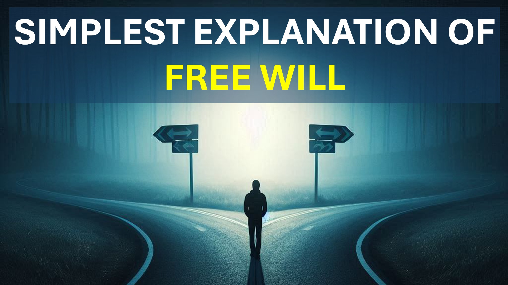

#freewill #cpperiment #thoughtexperiment #wordoffaith #Christian #faith #yahweh

免费存在吗？

在一个简单的思想实验中，我们将证明存在自由意志，而且 - 也不存在。

嗯。

想象我们有2个个人，它们的每个原子都具有完全相同的特性。

也是每个原子都经历了完全相同的事件。

两个人之一的行动是否有可能至少一次？

如果这个人有无限的数量怎么办？

如果相同的个体的无限数量之一，则有无限的时间，而左转，而不是右转，则存在自由意志。

所以，是的 - 自由存在。

但是，我相信您所经历的事件可以增加或减少自由意志。

不仅是您的自由意志，而且是后代的意志。

记住，我们的基因会影响我们的行为 - 我们的行为也会影响我们的基因。

最后一个音符。

人类有自由意志，我们可以自由限制我们的自由意志。

了解更多

网站：www.liveabove3d.com

youtube：www.youtube.com/@live.above.3d

tiktok：www.tiktok.com/@live.above.above.above.3d〜 ~~ Twitter：www.twitter.com/live_above_3d

reddit：www.reddit.com/user/live-above-3d

www.facebook.com/profile/100092339087423

#viral #Foryou＃liveabove3d #god #god #jesus #christianapologetics #loveofgod #faithiandristianity＃ ristianity #faithvsscience #seekingtruth #logicicandbelief＃Christianity101 #quesioningatheism #debunkingmyths #godandscience #discoveringfithingfith #christianliving #blessed #hope #hope #beyondthephysical

~ @live.above.3d @live_above_above_above_above_above_3d @live-above-live-above-live-above-3d @samshamsham @samsham @smsham @ssham @ssham @@sdaile @ememlume @ememlinceltence osmoknowledge @theSessAgeChannel1 @ cureiositysp @veritasium @kapchatfield.07 @ken.arrington @tedtoks @the.anonymonous.prophet @offthekirb @startalk @startalk

~ kirb @startalk @startalk
