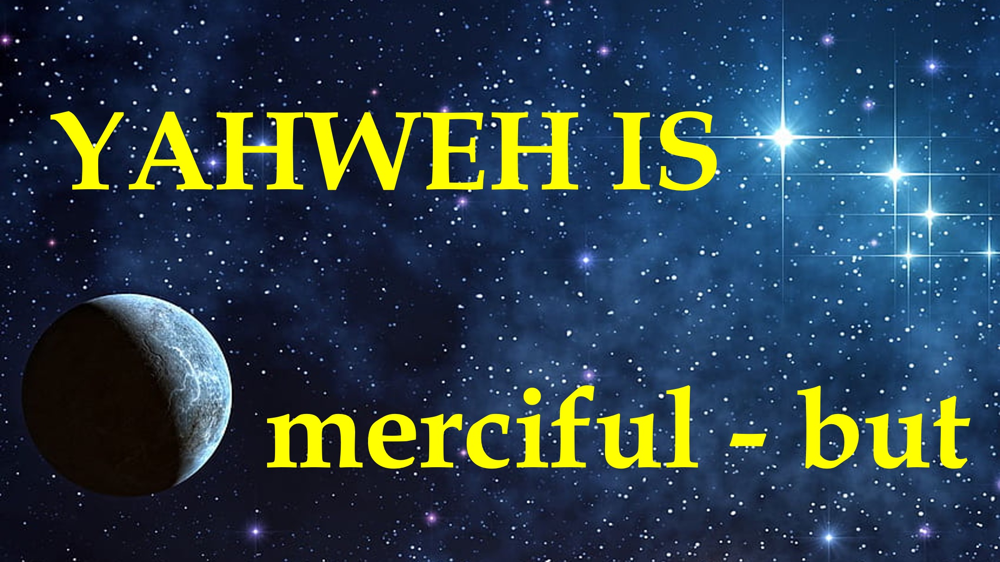

#Heavenislegal #mercy #adam #eve #hezekiah #খ্রিস্টান #ফাইথ #ইয়াহওয়ে

ইয়াহওয়ে করুণাময় - তবে।

হুমম।

যিহোবা রাজা হিষ্কিয়াকে বলেছিলেন যে তিনি মারা যাবেন। এই শুনে

হিজেকিয়াহ করুণার জন্য কাঁদলেন।

সুতরাং, God শ্বর তাঁর জীবনে 15 বছর যুক্ত করেছেন - 2 কিং 10।

এটি আদম এবং ইভের সাথে তুলনা করুন।

শয়তান তাদের বলেছিল:

"knows শ্বর জানেন যে আপনি যখন নিষিদ্ধ ফলটি খান, আপনি দেবতা হিসাবে থাকবেন"

সুতরাং, God শ্বর তাদের অমান্য করার জন্য তাদের মুখোমুখি হওয়ার পরে, করুণার জন্য জিজ্ঞাসা করার পরিবর্তে, তারা অবশ্যই ভেবেছিলেন:

"আমি আমার সুযোগগুলি গ্রহণ করব - God শ্বর কিছু লুকিয়ে থাকতে পারেন" - আদিপুস্তক 3:11 - 13

আপনার জীবনের এমন কিছু ক্ষেত্র রয়েছে? আপনি কোথায় আছেন: God শ্বরের উপর নির্ভর করার চেয়ে "আপনার সুযোগগুলি গ্রহণ করা"?

আপনার ভুলটি গ্রহণ করুন - আপনার ভুলটি গ্রহণ করুন এবং to শ্বরের কাছে ফিরে যান এটি আপনার জন্য একটি কল।

অবশেষে, মনে রাখবেন যে করুণা সর্বদা রায় জিতবে।

তবে যারা কোন করুণা দেখায় না তাদের প্রতি কোন দয়া হবে না - জেমস 2:13।

করুণার জন্য কোনও আবেদন প্রত্যাখ্যান করবেন না।

শালম।

পরবর্তী বার্তার শিরোনাম রয়েছে: "সদাপ্রভু না বলেন না"

আপনি অবাক হবেন, সুতরাং সেই বার্তাটি অবহিত করার জন্য সাবস্ক্রাইব করুন।

কোটস

করুণা বিচারের উপর জয়লাভ করে, তবে বিচার তাকে নির্দয় হবে যিনি কোনও করুণা দেখিয়েছেন না।

জেমস 2:13

যিনি বিশ্বাস করা বন্ধ করেন - তিনি বিদ্রোহ করেছেন।

Liveabove3d

বাইবেল আয়াত

বিচারের জন্য এমন একজনকে নির্দয় হবে যিনি কোনও করুণা দেখিয়েছেন না; করুণা বিচারের উপর জয়লাভ করে।

জেমস 2:13 (নাসবি 1995)

20 সেই দিনগুলিতে হিষ্কিয় অসুস্থ ছিল মৃত্যুর জন্য। ওমোজের পুত্র হযরত যিশাইয় তাঁর কাছে এসে তাঁকে বললেন, এইভাবে প্রভু বলে, তোমার বাড়িটিকে যথাযথভাবে স্থাপন করলেন; আপনি মারা যাবেন না, বেঁচে থাকবেন না।

2 তারপরে তিনি প্রাচীরের দিকে মুখ ফিরিয়ে পালন করলেন, এবং প্রভুর কাছে প্রার্থনা করলেন,

3 আমি তোমাকে অনুরোধ করছি, হে প্রভু, এখন মনে রাখবেন যে আমি কীভাবে আপনার সামনে সত্য এবং নিখুঁত হৃদয় দিয়ে চলেছি, এবং পেয়েছি যা আপনার দৃষ্টিতে ভাল তা সম্পন্ন। এবং হিজেকিয়াহ কে কাঁদল।

4 এবং এটি ঘটেছিল, পূর্বে যিশাইয় মধ্য আদালতে চলে গেলেন, প্রভুর বাক্যটি তাঁর কাছে এসে বললেন,

5 আবার ঘুরে ফিরে আমার লোকদের অধিনায়ক হিজিকিয়াকে বলুন, এভাবে তিনি বলেছিলেন প্রভু, দায়ূদ তোমার পিতার দেবতা, আমি তোমার প্রার্থনা শুনেছি, আমি তোমার অশ্রু দেখেছি: দেখুন, আমি তোমাকে নিরাময় করব: তৃতীয় দিন তুমি প্রভুর ঘরে উঠে যাবে।

6 এবং আমি আপনার পনের বছরগুলিতে যুক্ত করব; এবং আমি তোমাকে এবং এই শহরটিকে আশেরিয়ার রাজার হাত থেকে সরিয়ে দেব; এবং আমি এই শহরটিকে আমার নিজের পক্ষে এবং আমার চাকর দায়ূদের জন্য রক্ষা করব।

2 কিং 10: 1 - 6

11 এবং তিনি বলেছিলেন, কে আপনাকে বলেছিল যে তুমি উলঙ্গ ছিল? তুমি কি গাছ খেয়েছে, যার মধ্যে আমি তোমাকে আদেশ দিয়েছি যে তুমি খেতে হবে না?

12 এবং লোকটি বলল, আপনি যে মহিলাকে আমার সাথে থাকতে চান, তিনি আমাকে গাছটি দিয়েছিলেন, এবং আমি খেয়েছি।

13 এবং প্রভু God শ্বর মহিলাকে বললেন, আপনি কী করেছেন? এবং মহিলাটি বলল, সর্পটি আমাকে বেঁধে দিয়েছে, এবং আমি খেয়েছি।

জেনেসিস 3:11 - 13

আরও জানুন

ওয়েবসাইট: www.liveabove3d.com

টিকটোক: www.tiktok.com/@live.above.3d উপরে -3 ডি

ইনস্টাগ্রাম: www.instagram.com/live.above.3d Liveabove3d #god #জেসস #ক্রিস্টিয়ানপোলজিকস #লোভফগড #ফাইথানড্রিসন #ট্রুথিনক্রিস্টিয়ানটি #এসসিআইএনএএনডিফাইথ #ক্রিশ্চিয়ান এক্সপ্লাইন্ড #বেলিউইনজেসসেসিং #ইন্ডিস্ট্রিজিংফোরফাইথ # নাস্তিকতা #ডিবিউঙ্কিংমাইথস #গড্যান্ডসায়েন্স #ডিসকভারিংফাইথ #ক্রিস্টিয়ানলাইভিং #ব্লেসড #হোপ #ইনসিপারেশন # Beliew.

@Live.above.3d @Live_above_3d @লাইভ-এবোভ -3 ডি @স্যামশামাউন @ডেইলিডোসফডম @এমপ্যাথিক_মাইন্ডফুলনেস @টেচনিওলাসডিয়া @ক্যাসমোকনলজ @কসমোকনলজ @থাইচেনস্লেজ @ the.ynnomous.prophet @fthekirb @স্টার্টালডটোকস