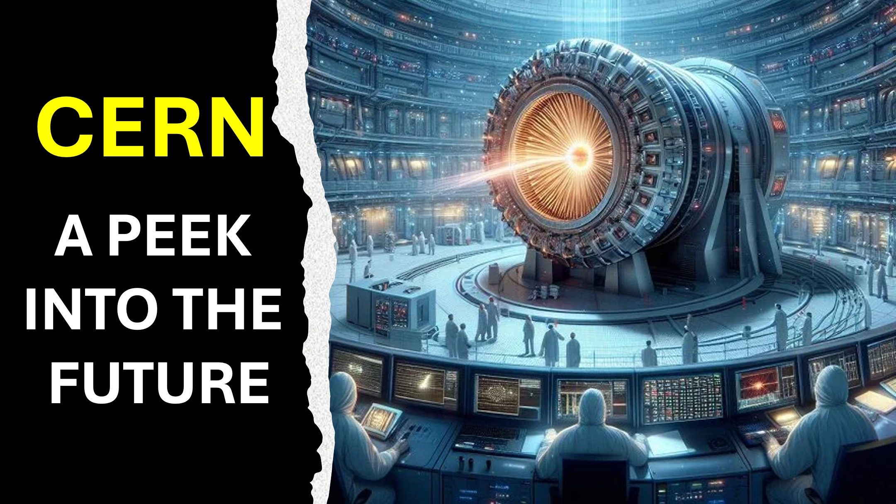

#cern #portal #lucifer #future #stargate #eve #adam #christian #faith #yahweh #god

من هو الأكثر ذكاءً منهم جميعًا؟

وكيف ستعبثنا؟

hmmmmmm.

في حديقة عدن ، استخدم لوسيفر أكثر حيوانات حكمة حول تحقيق هدفه.

سجلات سفر التكوين 3 يسجل ما يلي: "كان الثعبان ذكيًا من أي وحش في المجال الذي صنعه الرب".

الآيات التالية تفاصيل كيف حقق الثعبان هدفه المتمثل في خداع حواء.

في السنوات القادمة ، سيتم السماح لوسيفر بفتح جزء من البعد الرابع.

كما هو الحال في حديقة عدن ، فهو يستخدم أكثر البشر الذين يمكنهم العثور عليه - العلماء.

العلماء في CERN مهتمون بفتح أبعاد أخرى.

سيكون لديهم ما يرغبون ، لكن النتيجة ستكون - كيف سأقول: "كارثية!"

الفصل 9. الله على جبينهم ".

"وفي تلك الأيام سيسعى الناس إلى الموت ولن يجدوا ذلك".

آيات الكتاب المقدس

gensis 3: 1-7

الوحي 9: 1-11

تعرف

youtube: www.youtube.com/@live.above.3d

tiktok: www.tiktok.com/@live.above.3d

 Twitter: www. twitter.com/live_above_3d

reddit: www.reddit.com/user/live-above-3d

instagram: www.instagram.com/live.above.3d

 facebook: www.facebook.com/profile/100092339087423

 #viral #foral #liveabove3d #jesus #ChristianApologetics #loveofgod #faithandReason #TrutheriSianity #ScienceAndffiStianity #undrossingchristianity #faithvsscience #seeekingtruth #logicandbelief #المسيحية 101 #questioningeism #debunkingmyths #godandscience #discoveringfaith #christianliving #blated #hope-spove- @ @ @ @ @ @ @ @ @ اللف @spacerewindtechnoplusmediacosmoknowledge @themessagechannel1curiositysperitasium @kapchatfield.07 @ken.arrington ettoks @the.anonymous.prophethekirb من أي وحش من المجال الذي صنعه الرب الله. وقال للمرأة ، نعم ، قال الله ، لن تأكل من كل شجرة في الحديقة؟

2 وقالت المرأة في الثعبان ، قد نأكل من ثمرة أشجار الحديقة:

3 ولكن من ثمرة الشجرة التي هي في وسط الحديقة ، قال الله ، يي لا تأكل منه ، ولا يجوز لك أن تلمسها ، خشية أن تموت.

4 و Serpent قال للمرأة ، أنت لا تموت بالتأكيد:

5 لأن الله يعلمون أنه في اليوم ، تأكلت ، ثم يتم فتح عينيك ، وستكونوا كآلهة ، تعرف الخير والشر.

6 وعندما رأت المرأة أن الشجرة كانت جيدة للطعام ، وأنها كانت ممتعة للعينين ، وشجرة ترغب في جعلها حكيمة ، أخذت ثمارها ، وأكلت ، وأعطت ، وأعطت أيضا لزوجها معها ؛ وقد أكل.

7 وتم فتح عيونهما ، وكانوا يعلمون أنهم عراة ؛ وخيطوا أوراق التين معًا ، وجعلوا آآآن.

gensis 3: 1-7

9 وتبدو الملاك الخامس ، ورأيت نجمة تسقط من السماء إلى الأرض: وتم إعطاء مفتاح الحفرة التي لا نهاية لها.

2 وفتح الحفرة القاع. وهناك دخان من الحفرة ، مثل دخان الفرن العظيم ؛ والشمس والهواء مظلمة بسبب دخان الحفرة.

3 وخرجت من الجراد الدخان على الأرض: وتم إعطاء قوة لهم ، لأن عقارب الأرض لها قوة.

4 وقد أمرهم بعدم إيذاء عشب الأرض ، ولا أي شيء أخضر ، ولا أي شجرة ؛ ولكن فقط هؤلاء الرجال الذين ليسوا ختم الله في جباههم.

5 ولهم تم إعطاؤهم أنه يجب ألا يقتلهم ، ولكن يجب أن يتم تعذيبهم لمدة خمسة أشهر: وكان عذابهم عذابًا للعقرب ، عندما قام بإرهاق رجل.

6 وفي تلك الأيام يسعى الرجال إلى الموت ، ولا يجدونها ؛ ويجب أن ترغب في الموت ، وينفد الموت منهم.

7 وكانت أشكال الجراد مثل الخيول التي أعدت للمعركة ؛ وعلى رؤوسهم كانت كما كانت تيجان مثل الذهب ، وكانت وجوههم وجوه الرجال.

8 وكان لديهم شعر كشعر من النساء ، وكانت أسنانهم أسنان الأسود.

9 وكان لديهم صدرية ، كما كانت صدرية من الحديد. وكان صوت أجنحتهم كصوت العربات للعديد من الخيول التي تعمل للمعركة.

10 وكان لديهم ذيول مثل العقارب ، وكانت هناك لسعات في ذيولهم: وكانت قوتهم إيذاء الرجال خمسة أشهر.

11 وكان لديهم ملك عليهم ، وهو ملاك الحفرة القاع ، التي اسمها في اللسان العبري هو Abaddon ، ولكن في اللسان اليوناني لهما اسمه أبوليون.

Revelation 9: 1-11tongue hath اسمه Apollyon.

الوحي 9: 1-11