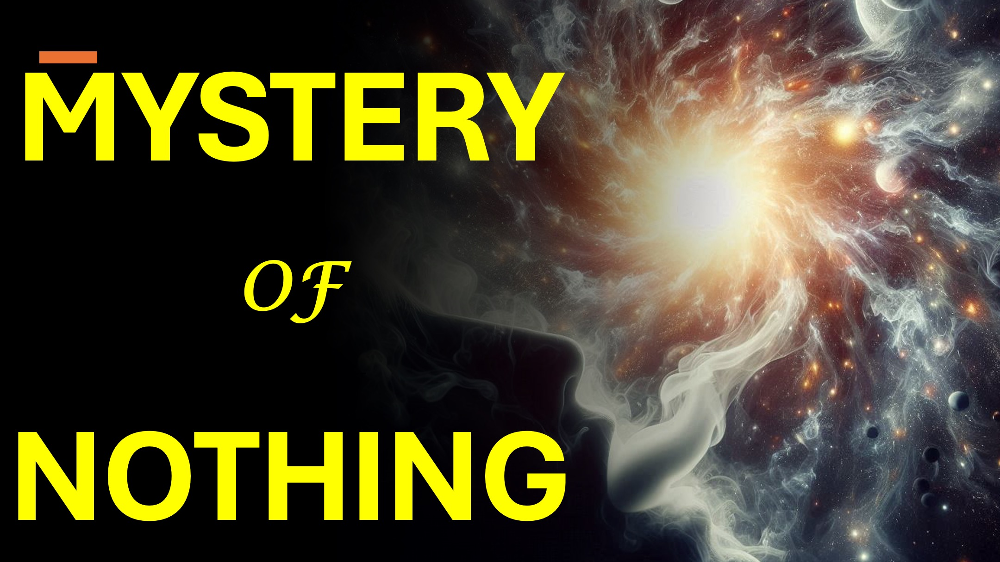

#mysterynothing #nothing #Universe #fourthdimension #christian #faith #yahweh #god

Rien n'existe-t-il?

Hmmmmm.

L'univers - est apparu de rien.

Particules - apparaissent souvent à partir de rien - au niveau quantique.

Les scientifiques conviennent que nous ne pouvons pas voir un corps quatre dimensions.

Nous verrions plutôt une projection 3D du corps 4D - n'apparaissant de rien.

Il est possible que le «rien», qui fait «quelque chose», soit quatre dimensions.

Si c'est le cas, tout ce qui apparaît de rien (y compris l'univers), sont des projections de la quatrième dimension.

Hmmmmm.

Une chose est plus réelle que sa projection.

Par exemple, nous sommes plus réels que nos ombres.

Même ainsi, le 4D rien qui a créé (ou plutôt projeté) l'univers est plus réel que l'univers.

Même si c'est plus réel, ce n'est rien, car il ne peut pas être mesuré ou observé dans le monde physique.

Pour le dossier - «L'univers, les âges ont été encadrés par la parole de Dieu, de sorte que les choses qui sont vues n'étaient pas faites de choses visibles.» - Hébreux 11: 3

Nous ne pouvons pas tout déballer dans cette vidéo - comme et abonnez-vous pour en savoir plus.

Versets bibliques

Par la foi, nous comprenons que les mondes étaient encadrés par la Parole de Dieu, de sorte que les choses qui sont vues n'étaient pas faites de choses qui apparaissent.

Hébreux 11: 3

En savoir plus

Site Web: www.liveabove3d.com

YouTube: www.youtube.com/@live.above.3d

tiktok: www.tiktok.com/ @ live.above.3d

Twitter: www.twitter.com/live_above_3d

reddit: www.reddit.com/user/live-above-3d

Instagram: www.instagram.com/live.above 0 #Evidenceforgod #UnderstandingChristianity # # Foivscience #seekingtruth #logicandbelief # christianity101 #questioningAtHeism #DeBunkingMyths #Godandscience #DiscoveringFaith #ChristianLiv Empathetic_Mindfulness @spacerewind @technoplusmedia @cosmoknowledge @ thessagechannel1 @curiositysp @veritasium @ kapchatfield.07 @ ken.arrington @tedtoks @ the.anonymous.prophet @offthekirb @startalket @offthekirb @startalk

