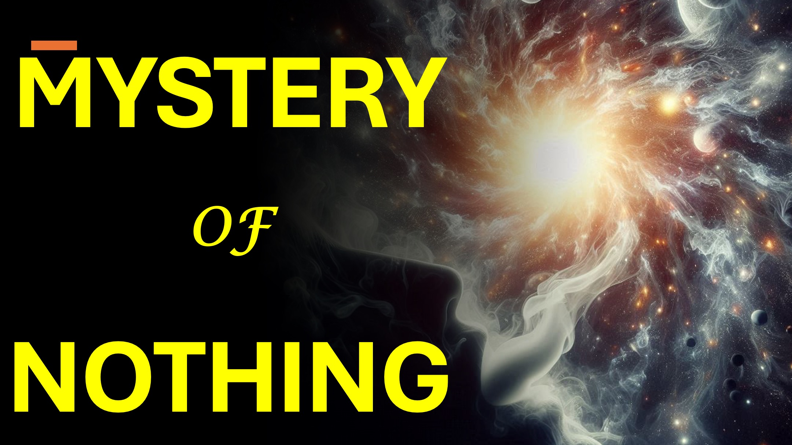

#MySterynothing #Nothing #universe #fourthDimension #Christian #faith #yahweh #god

क्या कुछ भी मौजूद नहीं है?

हम्म्म्म।

ब्रह्मांड - कुछ भी नहीं से दिखाई दिया।

कण - अक्सर कुछ भी नहीं - क्वांटम स्तर पर दिखाई देते हैं।

वैज्ञानिक इस बात से सहमत हैं कि हम चार-आयामी निकाय नहीं देख सकते हैं।

बल्कि हम 4D शरीर का एक 3D प्रक्षेपण देखेंगे - कुछ भी नहीं से दिखाई देंगे।

यह तब संभव है, कि "कुछ भी नहीं", जो "कुछ" बनाता है, चार आयामी है।

यदि हां, तो कुछ भी नहीं (ब्रह्मांड सहित) से जो कुछ भी दिखाई देता है, वह चौथे आयाम से अनुमान हैं।

हम्म्म्म।

एक चीज इसके प्रक्षेपण से अधिक वास्तविक है।

उदाहरण के लिए, हम अपनी छाया से अधिक वास्तविक हैं।

यहां तक ​​कि, 4D कुछ भी नहीं जिसने ब्रह्मांड की तुलना में ब्रह्मांड को बनाया (या अनुमानित) ब्रह्मांड अधिक वास्तविक है।

भले ही यह अधिक वास्तविक हो, यह कुछ भी नहीं है, क्योंकि इसे भौतिक दुनिया में मापा या देखा नहीं जा सकता है।

रिकॉर्ड के लिए - "ब्रह्मांड, युगों को परमेश्वर के वचन द्वारा फंसाया गया था, ताकि जो चीजें देखी जाती हैं, वे उन चीजों से बनी न हों जो दिखाई देती हैं।" - इब्रानियों 11: 3

हम इस वीडियो में सब कुछ अनपैक नहीं कर सकते - इसलिए अधिक पसंद और अधिक के लिए सदस्यता लें।

बाइबिल छंद

विश्वास के माध्यम से हम समझते हैं कि दुनिया को परमेश्वर के वचन द्वारा फंसाया गया था, ताकि जो चीजें देखी जाती हैं, वे उन चीजों से बनी नहीं थीं जो दिखाई देती हैं।

हिब्रूज 11: 3

और जानें

वेबसाइट: www.liveabove3d.com

youtube: www.youtube.com/@live.above.3d

 tiktok: www.tiktok.com/ @live.above.3d

Twitter: www.twitter.com/live_above_3d

reddit: www.reddit.com/user/live-above-3d

     instagram: www.instagram.com/live.above .3d

Facebook: www.facebook.com/profile/100092339087423

#viral #foryou #liveabove3d #god #jesus #christianapologetics #loveofgod #faithandreason #scienchristianity #scientianitainity ऑनलाइन Fithyvsscience #seekingtruth Pathetic_mindnely @spacerewind @technoplusmedia @cosmoknowledge @themessagechannel1 @curiositysp @veritasium @kapchatfield.07 @ken.arrington @tedtoks @the.anonymous.prophet @offthekirb @startalket @offthekirb @startalk
