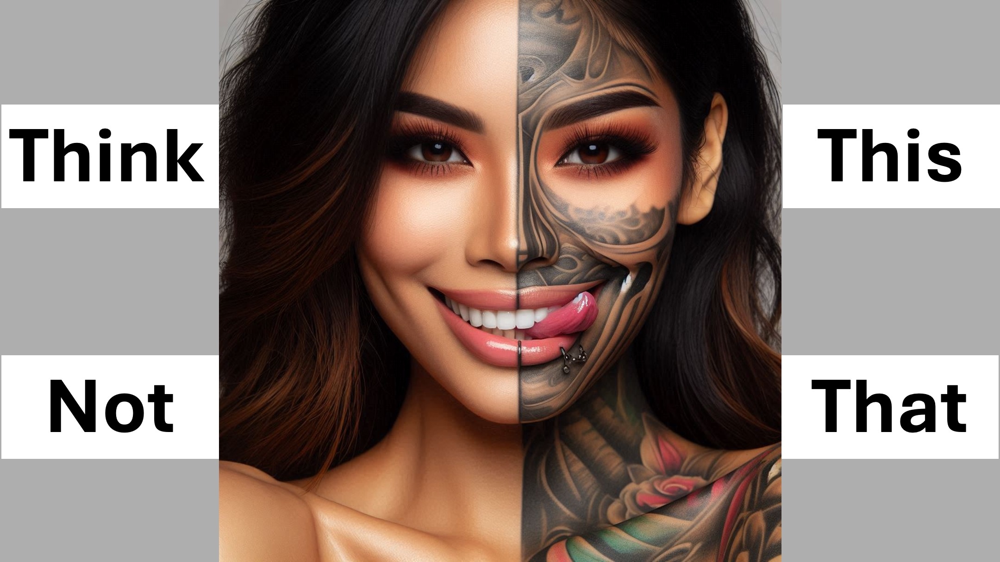

음주가 죄라고 생각한다면 그렇습니다.

음주가 죄가 아니라고 생각한다면 그렇지 않습니다.

“축복받은 사람은 그가 이미 승인 한 것에 대해 자신을 정죄하지 않는 사람입니다.”

“그러나 그것이 승인되었는지 확실하지 않지만 계속하십시오. 그렇다면 믿음을하지 않기 때문에 정죄받습니다.”

“믿음이 아닌 것은 죄입니다.” - 로마서 4 절 22 절과 23 절.

이것이 우리가 원하는만큼 살해하고 사고 할 수 있다는 것을 의미합니까?

그리고 우리가 스스로를 정죄하지 않으면 죄가 아닌가?

기억하십시오 :“믿음이 아닌 것은 죄입니다”.

또한,“믿음은 사랑을 통해 일합니다” - 갈라디아서 5 절 6.

살인이나 사고 할 수 있습니까? 믿음으로 사랑을 통해 일합니까?

만약 당신이 사랑을 통해 믿음으로 걷는다면, 당신이 무엇을하든 하나님을 기쁘게합니다.

죄에 대해 집착하기보다는 그리스도 께서하시는 일을 찾으십시오.

그리스도에 합류하십시오 - 그것은 믿음이 필요합니다 - 사랑을 통해 일하십시오.

#Believe #Christian #love #sin #Hell #Heaven #Faith #Yahweh #God #HigherLife

성경 구절

로마 4:22-23

갈라디아서 5 : 6

더 배우십시오  웹 사이트 : www.liveabove3d.com

youtube : www.youtube.com/@live.above.3d

tiktok : www.tiktok.com/@live.above.3d

트위터 : www. twitter.com/live_above_3d

reddit : www.reddit.com/user/live-above-3d

Instagram : www.instagram.com/live.above.3d

Facebook : www.facebook.com/ 프로필/100092339087423

#viral #foryou #liveabove3d #god #jesus #loveofgod #faithandreason #TruthInchristianity #ScienCeAndFaith #ChristianityInity #BelieveNInjesus #RideForforforforforforforforforforforforforforforforforforforforforforforforforforforforforforforforforforforforforforforforforforforforforforforfore ithvsscience #seekingtruth #logicandbelief #Christianity101 #QuestionIngateism #debunkingmyths #godandscience #CHRISTIANLIVING #BLEST #Hope #Inspiration #BeyondThephysical

@live.above.3d @live_above-3d @samshamoun @maindoseofwisdom @empathetic_mindfullest @tspacerewint @cosmonpermed @cosmoknep @kapchatfield. 07 @ken.arrington @tedtoks @the.anonymous.prophet @offthekirb @startalk

fthekirb @startalk

