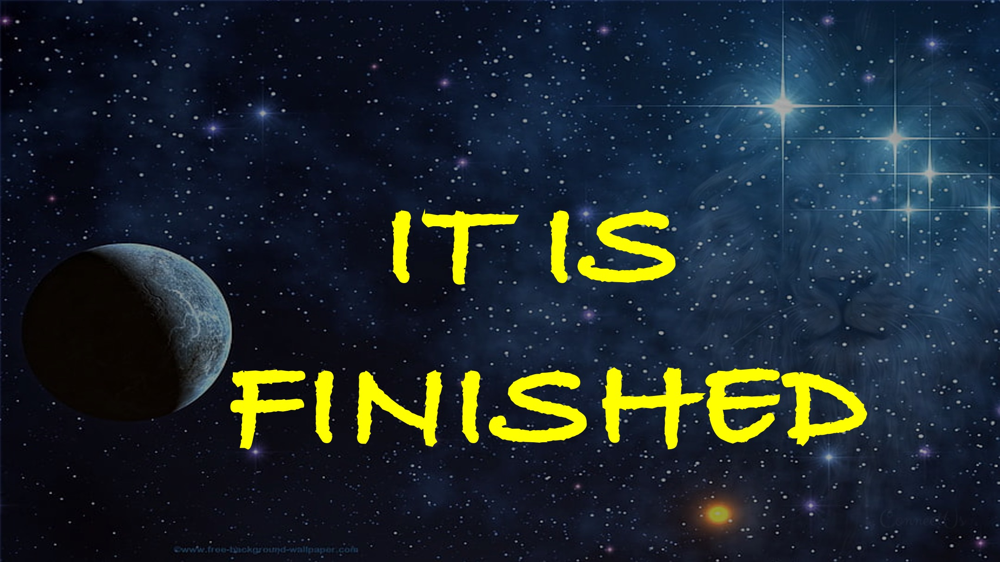

यदि ईश्वर हमारे लिए है, तो हमारे खिलाफ कौन हो सकता है?

भगवान, जिन्होंने अपने ही बेटे को नहीं छोड़ा, लेकिन उसे हम सभी के लिए छोड़ दिया, वह भी उसके साथ भी कैसे नहीं होगा और स्वतंत्र रूप से हमें सभी चीजें देगा?

जो हमारे खिलाफ कोई भी आरोप लाएगा, जब यह ईश्वर है जिसने हमें न्यायोचित ठहराया।

हम उचित हैं क्योंकि जो मर गया (मसीह यीशु) हमारे लिए सफल हो रहा है।

और कुछ भी नहीं - मसीह को रोक सकते हैं - हमें प्यार करने से।

न तो मृत्यु और न ही जीवन,

और न ही स्वर्गदूतों और न ही शासक       न ही चीजें मौजूद हैं और न ही चीजें,

और न ही शक्तियां,

और न ही ऊंचाई और न ही गहराई,

और न ही सभी सृष्टि में कुछ और,

हमें मसीह यीशु हमारे भगवान में परमेश्वर के प्रेम से अलग करने में सक्षम होगा।

romans 8 श्लोक 31 से।

जीत हासिल की गई है।

अभी जाओ - इन शब्दों का उपयोग करें - समृद्ध!

शालोम।

#believe #christian #love #sin #hell #heaven #faith #yahweh #god #higherlife

अधिक जानें

वेबसाइट: www.liveabove3d.com

youtube: www.youtube.com/@@ live.above.3d

tiktok: www.tiktok.com/@live.above.3d

ट्विटर: www.twitter.com/live_above_3d

reddit: www.reddit.com/user/live-bove -3d

Instagram: www.instagram.com/live.above.3d

facebook: www.facebook.com/profile/100092339087423

#viral #foryou #liveabove3d #god #god #jesus # FashAndReason #Truthinchristianity #Scienceandfaith #ChristianityExplained #BelieveInjesus #ReasonsForFaith #EvidentionForGod #EnderstandingScristianity #FaithVsScience #SeekingTruth ianliving #blessed #hope #inspiration #beyondthephysical

@live.above.3d @live_above_3d @live-above-3d @samshamoun @dailydoseofwisdom @empathetic_mindnely @spacerewind @technoplusmedia @cosmoknowlede @themessagechannel1 @curiositysp @vertasim
