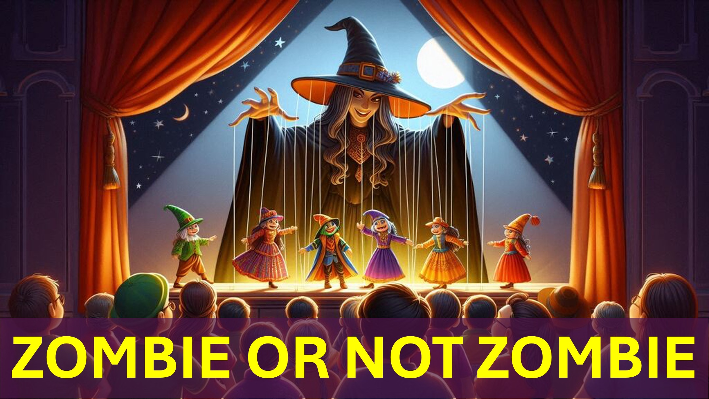

Ви можете бути зомбі.

Так.

Первісне значення зомбі: труп, керований відьмою.

Ви можете сказати: "Мене не контролюють відьма".

Ну, ваш розум приймає багато рішень, не знаючи.

Ці рішення приймаються на основі інформації - на вашу думку.

Це означає, що ваш розум контролюється тим, хто контролює цю інформацію.

Ефесяни 2 Вірш 2 говорить, що світ контролюється «Князем сили повітря».

Цей принц змушує людей не любити інших.

тоді не дивно, що є вагомі причини, які не люблять:

того жахливого співробітника, який поширює ці чутки про вас.

Присяжні ворогів, які хочуть вас знищити.

Кров спраглі релігійні фанатики.

педофіли.

Хммм.

Ви можете сказати: "Але я люблю всіх".

Ну, в цьому є більше, ніж очі.

ось приклад.

близький друг ставився до мене, незважаючи на мене, і змусив інших переслідувати мене.

Я пробачив другові до того, що інші запитували мене:

"Чому ти все ще ходиш з цим хлопцем після того, як він зробив?"

Минув час, і я часто використовую те, що сталося між моїм другом і я, щоб навчити своїх дітей поводитися.

Однак, мені потрібно зробити ще одне:

«Моліться за тих, хто, незважаючи на вас, і переслідуєте вас» - Метью 5 вірш 44.

вау.

Ми часто думаємо, що ми живемо правильно.

Однак лише дух правди може спрямувати нас жити правильно - Іван 16 Вірш 13

Ви бачите, коли пробачите, ви зупиняєте проблему від поширення.

Ще краще, коли молишся, ти можеш змінити проблему.

Хто б міг подумати, що робити більше, ніж пробачити.

Урок полягає в тому, що: Неможливо жити правильно без духу істини.

Глибший урок полягає в тому, що: "Багато зомбі не знають, що вони зомбі"

вихід, полягає в тому Щоб старанно охороняти свій розум - Прислів'я 4 Вірш 23.

Якщо цього не зробите, ви стаєте зомбі, керованим принцом сили повітря.

Шалом.

#believe #christian #love #sin #hell #heaven #faith #yahweh #god #higherlife

біблійні вірші

ephesians 2: 2, Mathew 5:44, John 16:33, Romans 12: 2 , Приповісті 4:23

Дізнайтеся більше

Веб -сайт: www.LiveAbove3d.com

.above.3d

Twitter: www.twitter.com/live_above_3d

reddit: www.reddit.com/user/live-above-3d

Instagram: www.instagram.com/Live.above.3d

Facebook: www.facebook.com/profile/100092339087423

#viral #foryou #liveabove3d #god #jesus #christianapologetics #loveofgod #faithandreason #truthinchristianity #scienceancefaith № SeekingTruth #LogicandBelief #Christianity101 #QuestioningAtheism #DeBunkingMyths #GodandScience #DiscoveringFaith #ChristianLiving #BLESS #HOPE #INSPIRATION #BEYONDTHEPHYSICAL

@Live.abve.3d @Live_3ddeph @live-above-3d @SamShamounsof AcereWind @technoplusmedia @Cosmoknowledge @themessagechannel1 @curiositysp @veritasium @kapchatfield.07 @ken.arrington @tedtoks @the.anonymous.prophet @offthekirb @startalk

біблійні вірші

в минулому ви йшли відповідно до курсу цього світу до принца сили повітря, дух, який зараз працює у дітей непокори:

Ефесянам 2: 2

, але я кажу вам, люблю своїх ворогів, благословляйте їх, що прокляття вас, зробіть добро тих, хто ненавидить вас, і моляться за них, які, незважаючи на вас, і переслідують вас;

Метью 5:44

Як він, Дух Істини, прийде, він направить вас у всю правду, бо він не буде говорити про себе; Але що б він не чує, що він буде говорити, і він буде показувати вас, що прийде.

Івана 16:33

не відповідати цьому світі: але ви трансформувались шляхом поновлення свого розуму, щоб ви могли довести, що таке добро, прийнятне, і ідеальне воля Бога.

Римляни 12: 2

Зберігайте своє серце з усією ретельністю; Бо з цього виходить питання життя.

Прислів’я 4:23

Твоє серце з усією ретельністю; Бо з цього виходить питання життя.

Прислів’я 4:23

