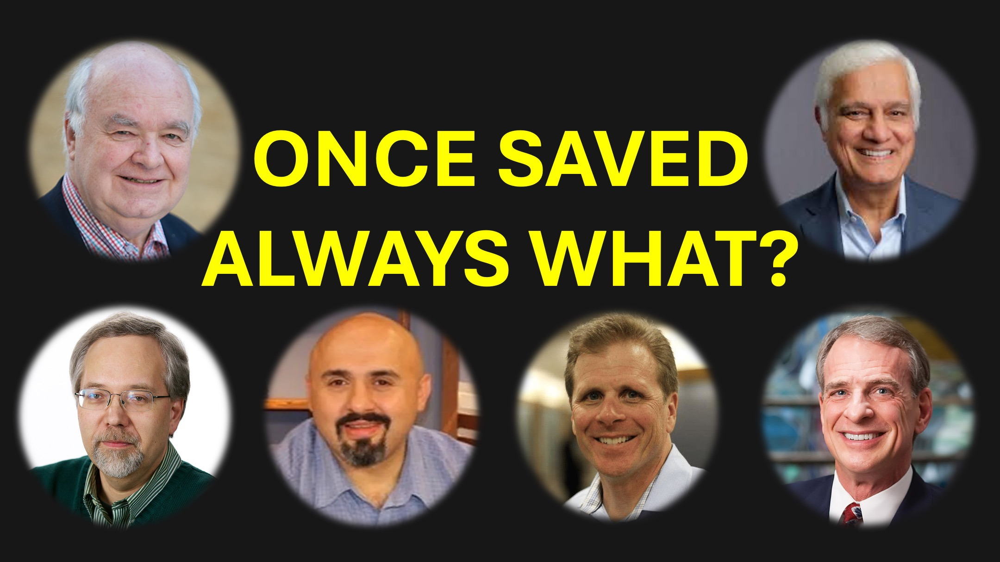

¿Puede un cristiano perder su salvación?

Vamos a romper esa pregunta en tres preguntas más pequeñas.

Preguntas más pequeñas que harán que la respuesta sea más clara.

La respuesta a la tercera pregunta tiene un giro, lo que explica por qué hay confusión sobre la pérdida de salvación.

Primera pregunta: ¿puede un cristiano, que en algún momento de su vida dijo la oración de la salvación, terminar en el infierno?

Sí.

Jesús dijo: "Rechazaré a muchos que hicieron milagros en mi nombre" - Mathew 7 versículos 22 y 23

Cualquiera puede decir la oración de la salvación. Sin embargo, solo aquellos que creen seguirán el ejemplo de Cristo.

hmmm.

Segunda pregunta: ¿puede un cristiano que peca, terminar en el infierno por su pecado?

No, pero -

Debe comprender la relación entre la salvación, el pecado y la muerte (o ser cortados).

La salvación cubre los pecados de los de Cristo.

El pecado cuando está completamente madurado te separará de Cristo. - James 1 Versículo 15.

La salvación no cubre a los que están cortados.

Sabes a dónde se dirige, pero comienzas el viaje porque puedes salir antes del final, no lo hagas.

hmmm.

Tercera pregunta: ¿puede alguien que creyera a Dios y recibió al Espíritu Santo, se dio la vuelta y rechazó a Dios?

Sí y No.

Sí, porque - Siempre tenemos libre albedrío. Somos libres, incluso para rechazar a Dios.

No, porque, a Dios, una persona que se da vuelta, nunca creyó en primer lugar.

Una vez más, te pregunto.

¿Puede un cristiano perder su salvación?

Déjame saber lo que piensas en la sección del comentario.

Shalom.

versos bíblicos

Muchos me dirán en ese día: 'Señor, Señor, ¿no hemos profetizado en su nombre, arrojan demonios en su nombre y hemos hecho muchas maravillas en su nombre? Entonces les declararé: 'Nunca te conocí; ¡Salga de mí, que practican la ilegalidad! "

Mathew 7:22 - 23

Entonces el mal deseo, cuando ha concebido, da a luz al pecado y al pecado, cuando está completamente madurado, provoca la muerte.

Santiago 1:15 (AMPC)

Aprenda más

Sitio web: www.liveBove3d.com

YouTube: www.youtube.com/@live.above.3d

tiktok: www.tiktok .com/@live.above.3d

Twitter: www.twitter.com/live_above_3d

reddit: www.reddit.com/user/live-above-3d

Instagram: www.instagram.com/ Live.ABOVE.3d

Facebook: www.facebook.com/profile/100092339087423

ok.com/profile/100092339087423

