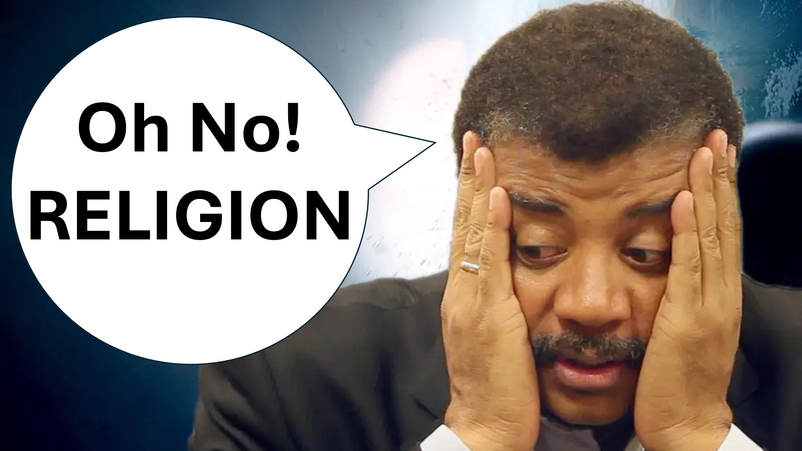

আপনি কি সাক্ষাত করেছেন - of শ্বরের পুত্র?

ঠিক কী - God শ্বরের পুত্র?

আমি ভেবেছিলাম যীশু নিজেকে ডেকেছিলেন - আপনি বলেন।

হুমম।

নীল ডিগ্রাস টাইসন একজন পরিচিত জ্যোতির্বিজ্ঞানী, লেখক এবং বিজ্ঞান যোগাযোগকারী।

সম্প্রতি, তিনি কার্যকরভাবে বলেছিলেন:

"আমরা জানি যে বিমানের ক্রাশ হওয়ার পরে মৃত্যু ধর্মের মধ্যে বৈষম্য করে না।"

"শয়তানবাদী নাস্তিকের মতো একইভাবে মারা যায়, মুসলিম, খ্রিস্টান বা ইহুদিদের মতোই।"

"আমরা আশা করব যে সত্য ধর্মের সদস্যরা বেঁচে থাকার জন্য, তবে এটি ঘটনা নয়।"

হা হা।

কারণ পরিবেশন করা হয়।

কে সাড়া দেবে?

হুমম। And

"God শ্বর এটিকে স্বীকৃতি দেন না।"

"বরং, God শ্বর বিশ্বাসীদের স্বীকৃতি দেয় - এবং আপনি এভাবেই একজন বিশ্বাসীকে জানেন।"

"বিশ্বাসীরা তাদের সমস্ত হৃদয় এবং তাদের প্রতিবেশীদের সাথে God শ্বরকে ভালবাসে" - ম্যাথু 22 আয়াত 37 থেকে 40। - 16 ও 18 টি আয়াত চিহ্নিত করুন

"যে কেউ বিশ্বাসীদের সন্ধান করে, যারা মৃত্যুর হাত থেকে বেরিয়ে এসেছিল, তারা কেবল তাদেরই খুঁজে পাবে না, খ্রীষ্টকেও খুঁজে পাবে।"

"God শ্বর বিশ্বাসীদের, তাঁর পুত্রদের ডেকেছেন এবং বলেছেন যে সমস্ত সৃষ্টি বেদনায় রয়েছে, তাঁর পুত্রদের উপস্থিতির জন্য কাঁদছে।" - রোমীয় 8 19 থেকে 22 পর্যন্ত।

"কে সাড়া দেবে?" - আমি জবাব দিলাম।

"God শ্বরের পুত্ররা God শ্বরের প্রতি আন্তরিক তৃষ্ণার্তকে সাড়া দেয়" - বলেছিল ছোট্ট কণ্ঠস্বর।

"বিজ্ঞানের মধ্যে আলো খুঁজে পাওয়া কেউ কেন God শ্বরের প্রতি তৃষ্ণা?" - আমি জিজ্ঞাসা করেছি।

"বিচারের দিন, বিজ্ঞানীদের জীবন যারা the শ্বরের পক্ষে তৃষ্ণার্ত ছিল, তাদের বিচার করবে যারা করেনি।" - ছোট্ট ভয়েস জবাব দিল।

"কেন God শ্বর কেবল তাদের বাঁচাতে পারবেন না।" - আমি জিজ্ঞাসা করেছি।

এই কাছে, ছোট্ট কণ্ঠস্বর একটি গল্পের সাথে সাড়া দিয়েছে।

একজন মহিলার পোষা তোতা ছিল, তিনি অনেক পছন্দ করেছিলেন।

তাদের সম্পর্ক প্রেম এবং শ্রদ্ধার ভিত্তিতে নির্মিত হয়েছিল।

একদিন পোষা তোতা তাকে ছেড়ে যাওয়ার সিদ্ধান্ত নিয়েছে।

তিনি পোষা প্রাণীর কাছে থাকার জন্য অনুরোধ করেছিলেন, কিন্তু তোতা তাকে ছেড়ে চলে গেল।

এখন অনেক বছর হয়ে গেছে এবং পোষা প্রাণীর তোতা দেশে ফিরে যেতে চায়।

এটির কাছে, মহিলা জবাব দিয়েছিল: "এসো - আমি খোলা হাত দিয়ে অপেক্ষা করছি"।

তবে পোষা প্রাণী কেঁদেছিল এবং বলল: "আপনাকে অবশ্যই আমাকে আপনার শক্তি দিয়ে ফিরিয়ে আনতে হবে"।

যার কাছে মহিলাটি জবাব দিয়েছিল: “আমি যদি আপনাকে ছেড়ে চলে যেতে পারি তবে আমাকে আপনাকে ফিরে আসতে হবে। তবে আপনি নির্দ্বিধায় চলে গেছেন, তাই অবাধে ফিরে আসুন ”।

"আদমের মাধ্যমে, মানবজাতি God শ্বরকে ছেড়ে চলে যেতে বেছে নিয়েছিল"

"খ্রিস্টের মাধ্যমে - God শ্বর মানবজাতি ফিরে স্বাগত জানাতে বেছে নিয়েছিলেন"

"যেহেতু God শ্বর আদমকে চলে যেতে বাধ্য করেননি, তাই তিনি মানবজাতিকে ফিরে আসতে বাধ্য করবে না "

" এটি একটি আইনী বিষয় " - ছোটটি বলেছিল।

"বিজ্ঞানীরা আইনগুলি বোঝেন এবং কীভাবে সেগুলি ভাঙা হয় না - অবশ্যই তারা এটি বুঝতে পারে" - আমি বলেছিলাম।

"তারা কি করবে?" - ছোট্ট উত্তর দিল।

হুমম।

বুদ্ধিমান হন। God শ্বরকে বিশ্বাস না করার জন্য আপনার কারণগুলি আইনী অর্থে গ্রহণযোগ্য প্রমাণ হবে না।

মনে রাখবেন, God শ্বর সমস্ত কিছু দেখেন এবং তিনি আমাদের বলেছিলেন যে তিনি প্রত্যেককে তাকে গ্রহণ করার প্রয়োজনীয় সুযোগ দিয়েছেন - 2 পিটার 3 আয়াত 9। আপনি নিঃশব্দে উপেক্ষা করেছেন - সবার জন্য প্রকাশ করা হবে।

এখানে আপনার কাছে আমার পরামর্শ, বিজ্ঞানী।

সঠিক ব্যক্তির জন্য অনুসন্ধান করুন; তাদের আন্তরিক প্রশ্ন জিজ্ঞাসা করুন।

এখনই সিদ্ধান্ত নিন।

আপনার জীবনের একক সবচেয়ে গুরুত্বপূর্ণ সিদ্ধান্ত।

শালম। । সত্যতা ওপেন #ইনসায়ারেশন #BEYONDTHEPHYSICL

@লাইভ.বোভ। 3 ডি @লাইভ_এবভ_3 ডি @লাইভ-এবোভ -3 ডি অ্যালক

আরও জানুন

ওয়েবসাইট: www.liveabove3d.com .tiktok.com/@লাইভ.বোভ .3 ডি

টুইটার: www.twitter.com/live_above_3d

reddit: www.reddit.com/user/live-above-3d

~

ইনস্টাগ্রাম: www.instagram.com/live.above.3d মার্ক 16: 17-18

জন 14: 12-14

রোমানস 8: 19-22

2 পিটার 3: 9

বাইবেল আয়াত

মার্ক 16: 17-18

জন 14: 12-14

রোমানস 8: 19-22

2 পিটার 3: 9