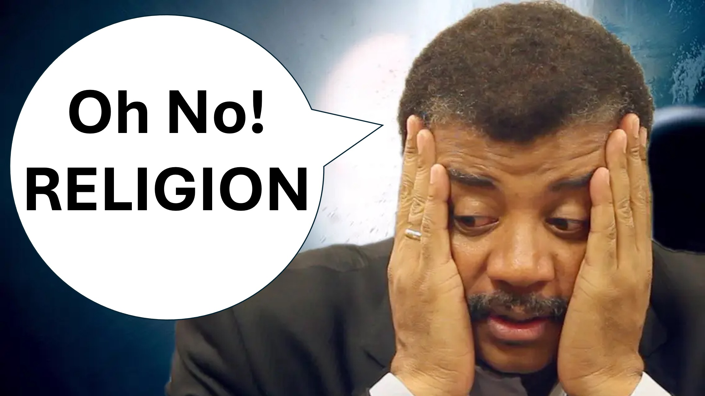

Hai incontrato - un figlio di Dio?

Che cosa è esattamente un figlio di Dio?

Ho pensato che fosse quello che Gesù si chiamava - dici.

hmmm.

Neil DeGrasse Tyson è un noto astrofisico, autore e comunicatore scientifico.

Di recente, ha effettivamente detto:

“Sappiamo che quando gli aeroplani si schiantano, la morte non discrimina tra le religioni."

"Il satanista muore allo stesso modo dell'ateo, come il musulmano, il cristiano o ebreo".

"Ci aspetteremmo che i membri di una vera religione sopravvivano, ma non è così."

HA HA.

Viene servito il motivo.

Chi risponderà?

hmmm.

Una piccola voce ha risposto e ha detto:

"I cristiani sono quelli che dicono di essere cristiani".

"Dio non lo riconosce."

"Piuttosto, Dio riconosce i credenti - ed è così che conosci un credente."

"I credenti amano Dio con tutto il loro cuore e anche i loro vicini" - Matteo 22 versetti da 37 a 40.

"I credenti guariscono i malati e non possono essere feriti da cose mortali". - Mark 16 versetti 17 e 18

"Chiunque cerchi diligentemente i credenti, che sono usciti dalla morte incolume, non solo li troverà, ma anche Cristo."

"Dio chiama i credenti, i suoi figli e dice che tutta la creazione sta soffrendo, gemendo per l'aspetto dei suoi figli." - Romani 8 da 19 a 22.

"Neil DeGrasse Tyson ha gemato" - ha concluso la piccola voce.

"Chi risponderà?" - Ho risposto.

"I figli di Dio rispondono a una sete seria di Dio" - disse la piccola voce.

"Perché qualcuno che ha trovato luce nella scienza, sete di Dio?" - Ho chiesto.

"Il giorno del giudizio, le vite degli scienziati che hanno sete di Dio, giudicheranno coloro che non lo hanno fatto." - Rispose la piccola voce.

"Perché Dio non li salverà." - Ho chiesto.

A questo, la piccola voce, ha risposto con una storia.

Una donna aveva un pappagallo per animali domestici, adorava così tanto.

La loro relazione è stata costruita sull'amore e sul rispetto.

Un giorno il pappagallo ha deciso di lasciarla.

Ha supplicato l'animale di rimanere, ma il pappagallo l'ha lasciata.

Sono passati molti anni e il pappagallo per animali domestici vuole tornare a casa.

A questo, la donna rispose: "Vieni - Sto aspettando con le mani aperte".

Ma l'animale ha pianto e ha detto: "Devi riportarmi con il tuo potere".

A cui la donna ha risposto: “Se ti avessi fatto andare, avrei dovuto farti tornare. Ma te ne sei andato liberamente, quindi torna liberamente ”.

"Attraverso Adamo, l'umanità ha scelto di lasciare Dio"

"Attraverso Cristo - Dio ha scelto di accogliere l'umanità"

"Dato che Dio non ha costretto Adamo ad andarsene, non costringerà nemmeno l'umanità a tornare"   "È una cosa legale" - ha detto il piccolo.

"Gli scienziati comprendono le leggi e come non sono rotti - sicuramente lo capiranno", ho detto.

"Lo faranno?" - rispose il piccolo.

hmmm.

Sii saggio.

Le tue ragioni per non credere a Dio non saranno prove accettabili in senso legale.

Ricorda, Dio vede tutto, e ci ha detto che dà a tutti l'opportunità necessaria per accettarlo - 2 Peter 3 Verse 9.

Il giorno del giudizio, quell'opportunità - che hai trascurato tranquillamente - sarà rivelato per tutti da vedere.

Ecco il mio consiglio per te, scienziato.

Cerca la persona giusta; Fai loro domande sincere.

Prendi questa decisione ora.

La decisione più importante della tua vita.

Shalom.

#SONSOFGOD #NeildegrasseTyson #Scientists #believe #Christian #Love #Faith #yahweh #god

#viral #foryou #liveabove3d #jesus #chesus #chesus #ChesAspaTiTeSplaces #ThEntianity onsforfaith #Evidenceforgod #understandingchristianity #faithvsscience #seekingtruth #logicandbelief #cristianity101 #questioningatheism #debunkingmyths #godandscience #discoveringfaith #christianliving #hope #inspiration #beyonsic @samshamoun @ dailydoseofwisdom @Empathetic_Mindfulness @SpaceRewind @technoplusmedia @Cosmoknowledge @themessagechannel1 @CuriositySp @veritasium @kapchatfield.07 @ken.arrington @tedtoks @the.anonymous.prophet @offthekirb @StarTalk

LEARN MORE

Website: www.liveabove3d.com

YouTube: www.youtube.com/@live.above.3d

tiktok: www.tiktok.com/@live.above.3d

Twitter: www.twitter.com/live_above_3d

Reddit : www.reddit.com/user/live-above-3d

Instagram: www.instagram.com/live.above.3d

Facebook: www.facebook.com/profile/100092339087423

Versi biblici   Marco 16: 17-18

Giovanni 14: 12-14

Romani 8: 19-22

2 Peter 3: 9

Versi della Bibbia

Marco 16: 17-18   Giovanni 14: 12-14

Romani 8: 19-22

2 Peter 3: 9

