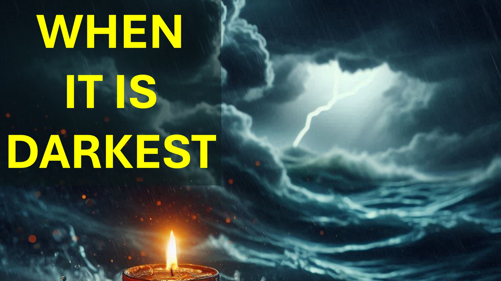

Di fronte ai guai, corri alla parola di Dio.

Quando il problema persiste, tu (essendo maturo) ti rendi conto che deve essere una prova.

Ti prepari per il lungo raggio facendo sacrifici come il digiuno o la semina.

Quando le cose diventano più calde, non sei disturbato.

piuttosto (sapendo che è più buio prima dell'alba) non vedi l'ora del punto più scuro e più caldo.

Quindi le cose diventano più calde, più calde e più calde.

"Sicuramente deve essere più oscuro ora" - pensi, con eccitazione per l'alba.

Lezione numero uno - Se sai che è più buio, allora non è più buio.

Quindi le cose diventano più calde - finché non sei confuso.

Quindi più caldo e più caldo - finché non sei frustrato.

Quindi più caldo, più caldo e più caldo - fino a quando non si fa prendere dal panico.

Nel panico, il problema è un mostro inarrestabile.

Nel panico, non puoi più ascoltare la parola di Dio.

Hai sempre saputo che Dio non può abbandonarti, eppure le parole sfuggono alle tue labbra:

"O Dio perché mi hai abbandonato!"

Lezione numero due - Tali situazioni oscurano il tuo accesso a Dio, in modo che la Parola di Dio in te - sia tutto ciò che hai.

hmmm.

"C'è un mistero che è stato nascosto dalle età e dalle generazioni, ma che ora ti è rivelato"

"La parola di Dio in te - la speranza della gloria". Colossesi 1 versetti 26 e 27.

È tutto sulla parola di Dio in te.

Quanto della Parola di Dio, lo sai davvero.

Ad esempio, puoi dire quale delle seguenti affermazioni è vera?

Dio ci guarisce quando vuole.

Dio ci guarisce se abbiamo fede.

Dio ci guarisce se non abbiamo peccato.

Qual è giusto?

Sei sicuro?

Puoi stare davanti allo specchio e usare la Parola di Dio per difendere la tua posizione?

Fammi sapere cosa ne pensi, nella sezione commenti.

Shalom.

#looktojesus #jesus #trials #believe #christian #love #faith #yahweh #god

#viral #foryou #LiveAbove3D #god #jesus #ChristianApologetics #LoveOfGod #FaithAndReason #TruthInChristianity #ScienceAndFaith #ChristianityExplained #BelieveInJesus #ReasonsForFaith #Evidenceforgod #understandingchristianity #faithvsscience #seekingtruth #logicandbelief #cristianity101 #questioningatheism #debunkingmyths #godandscience #discoveringfaith #christianliving #hope #inspiration #beyonsic @samshamoun @ dailydoseofwisdom @Empathetic_Mindfulness @SpaceRewind @technoplusmedia @Cosmoknowledge @themessagechannel1 @CuriositySp @veritasium @kapchatfield.07 @ken.arrington @tedtoks @the.anonymous.prophet @offthekirb @StarTalk

LEARN MORE

Website: www.liveabove3d.com

YouTube: www.youtube.com/@live.above.3d

tiktok: www.tiktok.com/@live.above.3d

Twitter: www.twitter.com/live_above_3d

Reddit : www.reddit.com/user/live-above-3d

Instagram: www.instagram.com/live.above.3d

Facebook: www.facebook.com/profile/100092339087423

Versi biblici ~ ~~ Anche il mistero che è stato nascosto da secoli e dalle generazioni, ma ora è reso manifestato ai suoi santi:

a cui Dio avrebbe fatto sapere quali sono le ricchezze della gloria di questo mistero tra i gentili; Che è Cristo in te, la speranza della gloria:

Colossesi 1: 26-27Christ in te, la speranza della gloria:

Colossesi 1: 26-27

