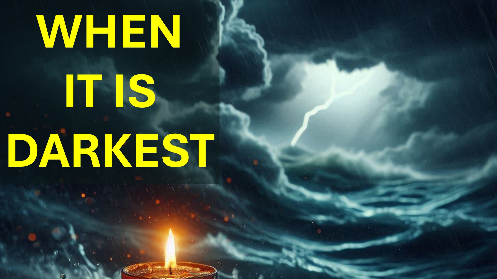

Sorun karşısında, Tanrı Sözü'ne koşarsınız.

Sorun devam ettiğinde, (olgunlaşmışsınız) bunun bir deneme olması gerektiğini anlarsınız.

Oruç veya ekim gibi fedakarlıklar yaparak uzun mesafeye hazırlanırsınız.

İşler ısındığında, rahatsız değilsiniz. Daha ziyade (şafaktan önce en karanlık olduğunu bilmek) en karanlık ve en sıcak noktayı dört gözle bekliyorsunuz.

o zaman işler daha sıcak, daha sıcak ve daha sıcak hale gelir.

“Elbette şimdi en karanlık olmalı” - Dawn için heyecanla.

Bir Numaralı Ders - En karanlık olduğunu biliyorsanız, o zaman en karanlık değildir.

o zaman işler daha da sıcaklaşır - karışana kadar.

o zaman daha sıcak ve sıcak - hayal kırıklığına uğrayana kadar.

sonra panik yapana kadar sıcak ve sıcak ve daha sıcak.

Panikte, sorun durdurulamaz bir canavar.

Panikte artık Tanrı'nın sözünü duyamazsınız.

Tanrı'nın seni terk edemeyeceğini hep biliyordunuz, ancak sözler dudaklarınızdan kaçıyor:

“Ey Tanrım neden beni terk ettin!”

İkinci ders - bu tür durumlar Tanrı'ya erişiminizi gizler, böylece siz içindeki Tanrı'nın sözü - sahip olduğunuz tek şeydir.

Hmmm.

“Çağlar ve nesillerden gizlenmiş, ancak şimdi size açıklanan bir gizem var”

“İçinizdeki Tanrı Sözü - Glory umudu”. Koloseliler 1 26 ve 27 ayetleri.

Tanrı’nın Sözü'nün ne kadarı - gerçekten biliyorsunuz.

Örneğin, aşağıdaki ifadelerden hangisinin doğru olduğunu söyleyebilir misiniz?

Tanrı istediği zaman bizi iyileştirir.

İnancımız varsa Tanrı bizi iyileştirir.

Günah işlemediysek Tanrı bizi iyileştirir.

Hangisi doğru?

Emin misin?

Aynanın önünde durabilir ve konumunuzu savunmak için Tanrı'nın Sözünü kullanabilir misiniz?

Yorumlar bölümünde ne düşündüğünüzü bana bildirin.

Shalom.

#looktojesus #Trials #believe #christian #Love #Faith #yahweh #god  #Viral #Foryou #Liveabove3d #god #jesus #christianapologetics #loveofgod #saithandReason #ChiAinity #Chinity #Chinity Onsforfaith #EvidenceForgod #UnderstandingChristianity #Faithvsscience #Seekingtruth #LogicandBelief #Christianity101 #GoDandscience #DiscoveringFaith #GoDandscience #DiscoveringFaith #ChristianLiving #blessical  @Inspiration #beyondthysical #Hope @Inspiration #Bey @samShamoun @ DailyDoseOfwisdom @Empatetic_Mindourness @Spacerewind @Technoplusmedia @Cosmoknowledge @themessagechannel1 @curiosysp @veritasium @kapchatfield.07 @ken.arrington @tedtoks @the.anonymous.prophet @ofoffthekirb @starb @starb @starb @  @wfthekirb @startalk

 @wwet @wb3:

YouTube: www.youtube.com/@live.above.3d

Tiktok: www.tiktok.com/@live.above.3d

Twitter: www.twitter.com/live_above_3d

Reddit : www.reddit.com/user/live-ebove-3d

Instagram: www.instagram.com/live.above.3d

Facebook: www.facebook.com/profile/100092339087423

İncil Ayetleri   Çağlar ve nesillerden saklanan gizem bile, ama şimdi azizlerine tezahür ettirilir:

Tanrı'nın Yahudi olmayanlar arasında bu gizemin ihtişamının zenginliklerini bileceğini; İçinde Mesih, Glory Umutu:

Koloseliler 1: 26-27Christ Sizde, Glory Hope:

Koloseliler 1: 26-27

