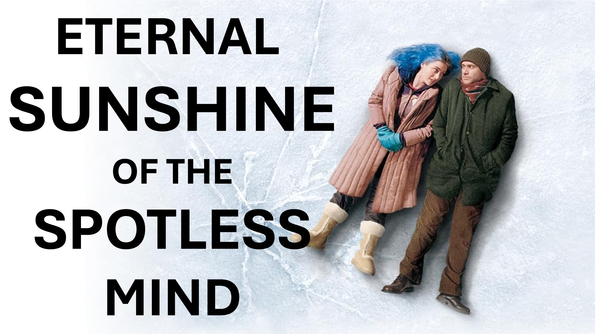

Full video: https://youtu.be/TI7iOnQ1hFY

What is entropy?

Science tells us that entropy causes things to – get more disorderly – with time.

So, what has this got to do with eternity and the spotless mind?

Well; the slightest imperfection - given enough time, will result to – absolute disorder.

Look around you, there is enough proof of human imperfection.

Imperfection may not be much of a problem over thousands of years. 

However, God’s plans are everlasting, so imperfection will not do.

The science of entropy also tells us that an outside force is needed to counter disorder.

For humans, that outside force is God.

The life of God is perfect.

Also, the life of God cannot be corrupted.

An incorruptible bedsheet would automatically clean you when you lie on it.

That is God’s effect on the imperfect person who submits themselves.

For this reason, God, took human form and lived amongst humans.

So that all who submit, to the influence of perfection, can live forever in perfection.

Submission (not attention) is all you need.

#entropy #disorder #citizenship #heaven #hell #immigration #jesus #christian #love #faith #yahweh #god 

#viral #foryou #LiveAbove3D #god #jesus #ChristianApologetics #LoveOfGod #FaithAndReason #TruthInChristianity #ScienceAndFaith #ChristianityExplained #BelieveInJesus #ReasonsForFaith #EvidenceForGod #UnderstandingChristianity #FaithVsScience #SeekingTruth #LogicAndBelief #Christianity101 #QuestioningAtheism #DebunkingMyths #GodAndScience #DiscoveringFaith #christianliving #blessed #hope #inspiration #BeyondThePhysical

@live.above.3d @live_above_3d @live-above-3d @samshamoun @dailydoseofwisdom @Empathetic_Mindfulness @SpaceRewind @technoplusmedia @Cosmoknowledge @themessagechannel1 @CuriositySp @veritasium @kapchatfield.07 @ken.arrington @tedtoks @the.anonymous.prophet @offthekirb @StarTalk

LEARN MORE

Website: www.liveabove3d.com

YouTube: www.youtube.com/@live.above.3d

TikTok: www.tiktok.com/@live.above.3d

Twitter: www.twitter.com/live_above_3d

Reddit: www.reddit.com/user/live-above-3d

Instagram: www.instagram.com/live.above.3d/

Facebook: www.facebook.com/profile.php?id=100092339087423

BIBLE VERSES

Being born again, not of corruptible seed, but of incorruptible, by the word of God, which liveth and abideth for ever.

1 Peter 1:23

14 And the Word was made flesh, and dwelt among us, (and we beheld his glory, the glory as of the only begotten of the Father,) full of grace and truth.

John 1: 14

16 For God so loved the world, that he gave his only begotten Son, that whosoever believeth in him should not perish, but have everlasting life.
17 For God sent not his Son into the world to condemn the world; but that the world through him might be saved.

John 3:16-17m might be saved.
John 3:16-17