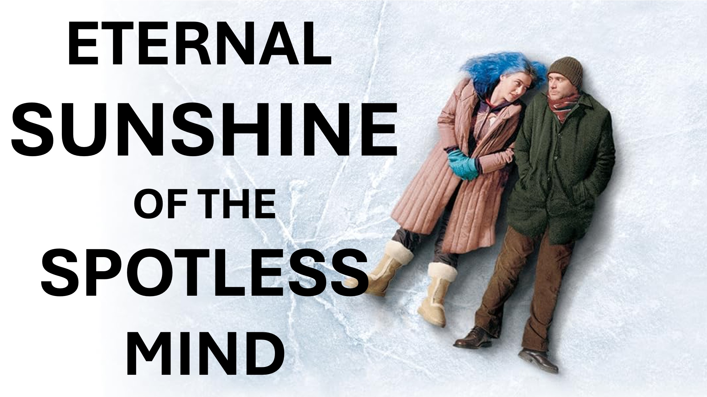

Video completo: https://youtu.be/ti7ionq1hfy

Che cos'è l'entropia?

La scienza ci dice che l'entropia fa sì che le cose - diventino più disordinate - con il tempo.

Allora, cosa c'entra questo con l'eternità e la mente immacolata?

Bene; Il minimo imperfezione - dato abbastanza tempo, si tradurrà a - disturbo assoluto.

Guardati intorno, c'è abbastanza prova dell'imperfezione umana.

L'imperfezione potrebbe non essere un grosso problema nel corso di migliaia di anni.

Tuttavia, i piani di Dio sono eterni, quindi l'imperfezione non lo farà.

La scienza dell'entropia ci dice anche che è necessaria una forza esterna per contrastare il disturbo.

Per gli umani, quella forza esterna è Dio.

La vita di Dio è perfetta.

Inoltre, la vita di Dio non può essere corrotta.

Un foglio da letto incorruttibile ti pulirebbe automaticamente quando ci si trova su di esso.

Questo è l'effetto di Dio sulla persona imperfetta che si sottomette.

Per questo motivo, Dio, prese forma umana e viveva tra gli umani.

in modo che tutti coloro che si sottopongono, all'influenza della perfezione, possano vivere per sempre alla perfezione.

L'invio (non l'attenzione) è tutto ciò di cui hai bisogno.

#entropy #disorder #citizenship #heaven #hell #immigration #jesus #christian #Love #Faith #yahweh #god

#viral #foryou #liveabove3d #jesus #christianapologetics #LoveOVEFGOD #FaitHandReason #TuthInCiThitHaTHITHITHITHITHITHITHITHITHITHITHITHITHITHITHITHITHITHITHITHITHITHITHITHITHITHE #ChristianityExplained #BelieveInJesus #ReasonsForFaith #EvidenceForGod #UnderstandingChristianity #FaithVsScience #SeekingTruth #LogicAndBelief #Christianity101 #QuestioningAtheism #DebunkingMyths #GodAndScience #DiscoveringFaith #christianliving #blessed #hope #inspiration #BeyondThePhysical

@live.above.3d @live_above_3d @live- sopra il 3D @samshamoun @dailydoseofwisdom @empatetic_mindness @spacerewind @technoplusmediate @cosmoknowledge @tethessagechannel1 @curiositysp @veritaSium @kapchatfield.07 @ken.arrington @tedtoks @the.anonymous @offtHeff @offthark ~~ ~~ : www.liveabove3d.com

youtube: www.youtube.com/@live.above.3d

tiktok: www.tiktok.com/@live.above.3d

Twitter: www.twitter.com /live_above_3d

reddit: www.reddit.com/user/live-above-3d

Instagram: www.instagram.com/live.above.3d

Facebook: www.facebook.com/profile/10009239087423

Versetti della Bibbia

che nasce di nuovo, non di semi corruttibili, ma di incorruttibile, dalla parola di Dio, che vive e dimora per sempre.

1 Pietro 1:23

14 E la parola fu fatta carne e dimorava tra noi (e abbiamo visto la sua gloria, la gloria come l'unico generato del Padre) pieno di grazia e verità.

Giovanni 1: 14

16 Per Dio ha così amato il mondo, che ha dato il suo unico figlio generato, che chiunque creda in lui non dovrebbe perire, ma avere la vita eterna.

17 Per Dio non mandò suo figlio nel mondo per condannare il mondo; Ma che il mondo attraverso di lui potrebbe essere salvato.

Giovanni 3: 16-17m potrebbe essere salvato.
Giovanni 3: 16-17

