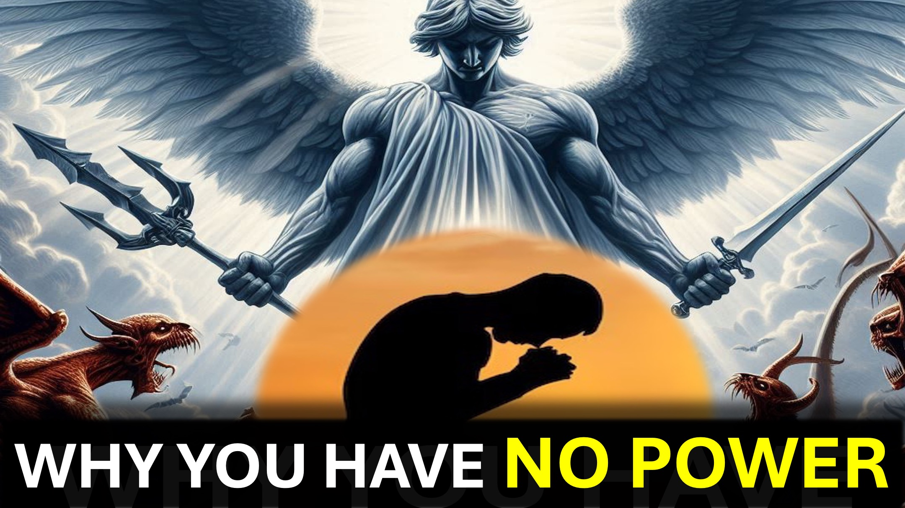

क्या दूसरे की लड़ाई जीतकर, अपनी लड़ाई जीतना संभव है?

आप आश्चर्यचकित होंगे।

विभिन्न प्रकार की शक्ति हैं; और ताकत - प्रत्येक शक्ति की - अलग है।

सुपरमैन की शक्ति मुख्य रूप से भौतिक और सक्रिय है।

मार्टिन लूथर किंग की शक्ति मुख्य रूप से मानसिक और निष्क्रिय थी।

यदि आप सफल होना चाहते हैं, तो आपको अपनी शक्ति की ताकत जानने की आवश्यकता है।

इमेजिन सुपरमैन ने एक विरोध मैच का नेतृत्व किया, या राजा एक हिंसक गिरोह को गिरफ्तार करने की कोशिश कर रहा है - मददगार नहीं।

हम्म।

प्रत्येक ईसाई को वही शक्ति दी जाती है, जिसने यीशु को मृत्यु से उठाया।

हमारी शक्ति की ताकत - विश्वास है।

विश्वास जो प्रेम से काम करता है।

शक्ति - मुख्य रूप से दूसरों की मदद करने के लिए है।

जब आप एक ईसाई बन जाते हैं, तो परमेश्वर आपकी आवश्यकताओं का ख्याल रखता है, ताकि आप दूसरों को उसे जानने में मदद कर सकें।

कल्पना करें।

आप कई समस्याओं का सामना करते हैं।

फिर भी जब आप प्रार्थना करते हैं, तो आप उनकी देखभाल करने के लिए भगवान को धन्यवाद देते हैं; फिर आप भगवान से यह दिखाने के लिए कहें कि दूसरों की मदद कैसे करें।

यह है कि भगवान को कैसे सुनना है - ऐसे शब्द जो विश्वास लाते हैं - जीत।

शालोम।

#victoryoffaith #poweroflove #poweroftheword #faith #believe #christian #love #jesus #christ

#viral #foryou #liveabove3d #god #yhwh #yahwhehologologolologeticsithirean समझाया #believeinjesus #ReasonsForFaith #EvidemForGod #UnderStandingChristianity #FaithVSscience #SeekingTruth d @लाइव-एबोव -3 डी @ StarTalk @samshamoun @dailydoseofwisdom @Empathetic_Mindfulness @SpaceRewind @technoplusmedia @Cosmoknowledge @themessagechannel1 @CuriositySp @veritasium @kapchatfield.07 @ken.arrington @tedtoks @the.anonymous.prophet @offthekirb

LEARN MORE

Website: www.liveabove3d .com

YouTube: www.youtube.com/@live.above.3d

 tiktok: www.tiktok.com/@live.above.3d

ट्विटर: www.twitter.com/live_above_3d   Reddit: www.reddit.com/user/live-above-3d

Instagram: www.instagram.com/live.above.3d

facebook: www.facebook.com/profile/100092339087423      छंद

इफिसियों 1: 17-21

1 जॉन 5: 4

galations 5: 6

मैथ्यू 6: 7-8

Mathew 6: 25-30

 romans 10:17

1 जॉन 4: 16W 6: 25-30

रोमियों 10:17

1 जॉन 4:16

