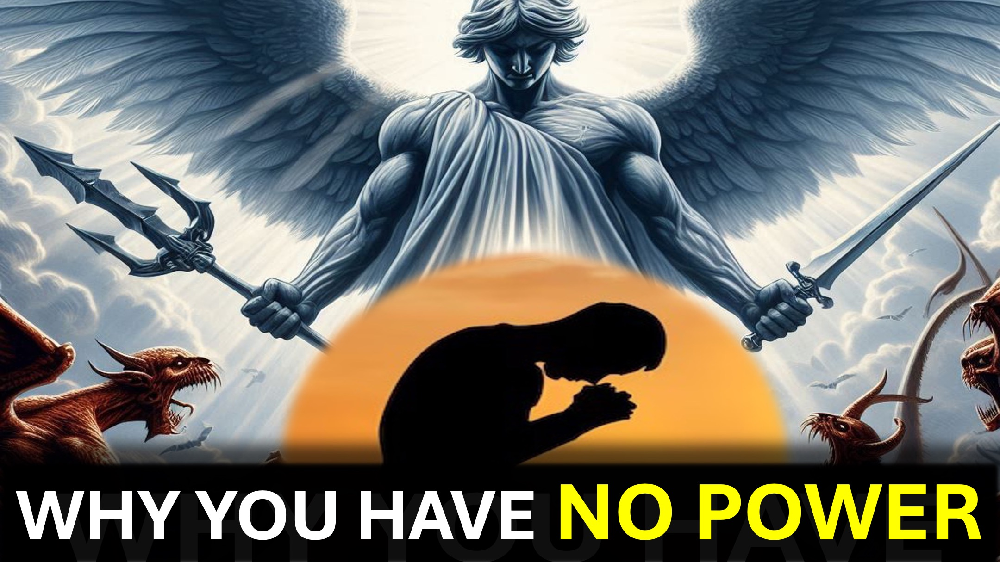

Bir başkasının savaşını kazanarak savaşınızı kazanmak mümkün mü?

Şaşıracaksınız.

Farklı güç türleri vardır; Ve her gücün gücü farklıdır.

Süpermen'in gücü esas olarak fiziksel ve aktiftir.

Martin Luther King’in gücü esas olarak zihinsel ve pasifti.

Başarılı olmak istiyorsanız, gücünüzün gücünü bilmeniz gerekir.

Superman'ın bir protesto maçına liderlik ettiğini veya King'in şiddetli bir çeteyi tutuklamaya çalıştığını hayal edin - yararlı değil.

Hmmm.

Her Hıristiyan, İsa'yı ölümden kaldıran aynı güç verilir.

Gücümüzün gücü - inançtır.

Sevgiyle çalışan inanç.

Güç - esas olarak başkalarına yardım etmektir.

Hıristiyan olduğunuzda, Tanrı ihtiyaçlarınızı karşılamaktadır, böylece başkalarının onu tanımasına yardımcı olabilirsiniz.

Hayal edin.

Birçok sorunla karşılaşıyorsun.

Yine de dua ettiğinizde Tanrı'ya onlara baktığı için şükredersiniz; O zaman Tanrı'dan size başkalarına nasıl yardım edeceğinizi göstermesini istersiniz.

Tanrı'yı ​​nasıl duyacağınızdır - inanç getiren kelimeler - zafer.

Shalom.

#VictoryAffaith #Poweroflove #Poweroftheword #Faith #Believe #Christian #Love #jesus #Christ

#Viral #Foryou #Liveabove3D #god #yhwh #yahweh #FristiAnapologetics #shrike #shrike Believinjesus #Reasonsforfaith #EvidenceForgod #Anderstancingchristianity #Faithvsscience #Seekingtruth #LogicandBelief #Christianity101 #godandingatheism #DiscoveringFaith #Bristhephicaling #blessing #Hope #Beyondthishical #blessed #Hope Live-A-A-A-A-3D @ StarTalk @samshamoun @dailydoseofwisdom @Empathetic_Mindfulness @SpaceRewind @technoplusmedia @Cosmoknowledge @themessagechannel1 @CuriositySp @veritasium @kapchatfield.07 @ken.arrington @tedtoks @the.anonymous.prophet @offthekirb

LEARN MORE

Website: www.liveabove3d .com

YouTube: www.youtube.com/@live.above.3d

Tiktok: www.tiktok.com/@live.above.3d

Twitter: www.twitter.com/live_above_3d

~~ ~~ ~ Reddit: www.reddit.com/user/live-ebove-3d

Instagram: www.instagram.com/live.above.3d

Facebook: www.facebook.com/profile/100092339087423

~~ ~~ İncil Ayetler

Efesliler 1: 17-21

1 Yuhanna 5: 4

Galations 5: 6

Mathew 6: 7-8

Mathew 6: 25-30

Romalılar 10:17

1 Yuhanna 4: 16W 6: 25-30

Romalılar 10:17

1 Yuhanna 4:16
