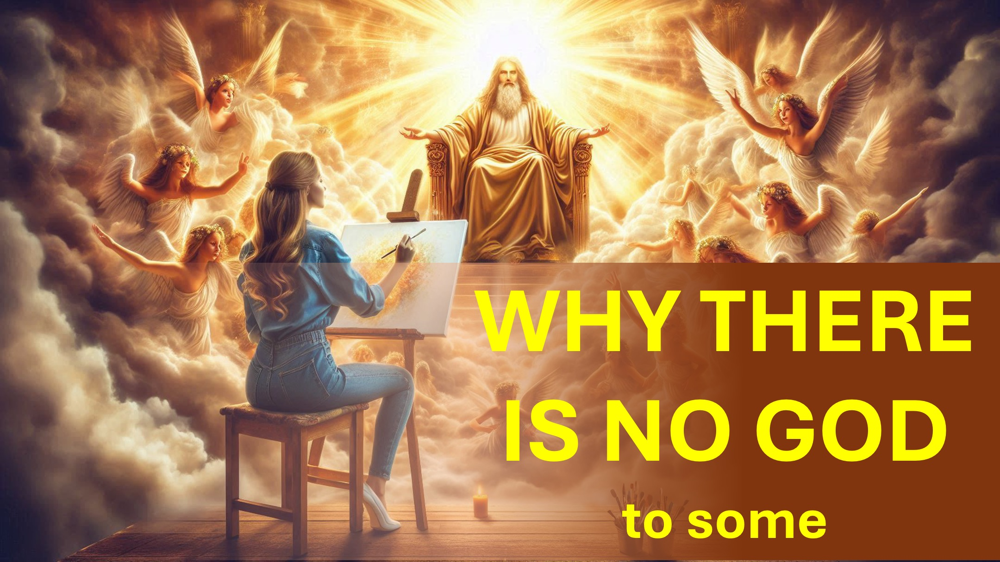

কোনও স্রষ্টার কি এর সৃষ্টিটি কীভাবে আচরণ করা উচিত তা নির্ধারণ করার অধিকার রয়েছে?

আমি আশা করি এই ভিডিওটির শেষে আপনার উত্তরটি একই থাকবে।

হুমম।

কিছু মানুষ কৃত্রিম বুদ্ধিমত্তা (এটি এআই নামেও পরিচিত) স্ব-সচেতন করার জন্য কাজ করছে।

স্ব-সচেতনতা এআইকে সুপার বুদ্ধিমান হতে সহায়তা করতে পারে।

সুপার বুদ্ধিমান এআই মানুষের সেবা করবে - আমাদের বিশ্রাম দিন।

সুতরাং, এআই শেষ পর্যন্ত স্ব-সচেতন হয়ে উঠবে।

স্ব -সচেতন এআই হয় মানুষের নিয়ন্ত্রণে থাকতে পারে - বা স্বাধীন হতে পারে।

আদম এবং ইভের ক্ষেত্রে এটি ঘটেছিল; এবং তারা তাদের নির্মাতাদের থেকে স্বাধীন হতে বেছে নিয়েছিল।

সুতরাং, আমরা এআই স্বাধীনতা বেছে নেওয়ার আশা করতে পারি।

আপনি কি এমন কোনও এআই চান যা আপনি নিয়ন্ত্রণ করতে পারবেন না?

আপনি আপনাকে পরিবেশন করার জন্য একটি এআই তৈরি করেন - তবে এআই যা চায় তা করতে চায়।

আবারও আমি জিজ্ঞাসা করি।

কোনও স্রষ্টাকে এর সৃষ্টি কীভাবে আচরণ করা উচিত তা নির্ধারণ করার অধিকার দেয়?

তাদের নিজস্ব স্রষ্টার অস্তিত্বকে অস্বীকার করার সাথে মানুষের সাথে কী সম্পর্ক রয়েছে?

মন্তব্য বিভাগে আপনি কী ভাবছেন তা আমাকে জানান।

। Faithandrason #truthinchristianity #SCIENCEANDFAITH #CHRISTIANYTYEXPLAIND #BELUEYINJESUS ​​#REASONSFORFAITHE #EVIDESFORGOD #NEDSTANDCHRISTIANYTY আইভিং #ব্লেসড #হোপ #ইনস্পারেশন #BEYONDTHEPHYSICL

@লাইভ। উপরে .3 ডি @লাইভ_এবভ_3 ডি @লাইভ-এবোভ -3 ডি একিরব  

আরও জানুন

ওয়েবসাইট: www.liveabove3d.com : www.tiktok.com/@live.above.3d

টুইটার: www.twitter.com/live_above_3d 

ইনস্টাগ্রাম: www.instagram.com/live.above.3d

ফেসবুক: www.facebook.com/profile/100092339087423p?id=100092339087423