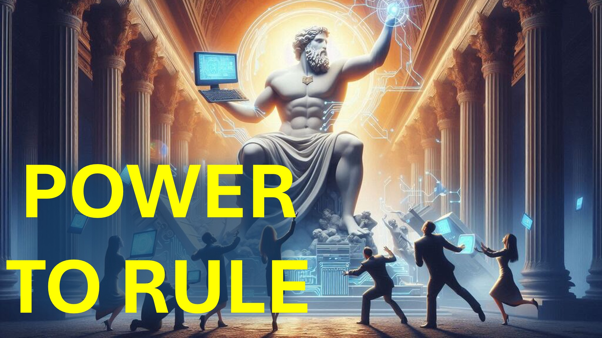

Perché AI è la piattaforma perfetta - per governare il mondo?

Qui andiamo.

L'ex angelo della luce - noto anche come Lucifero - vuole essere come Dio.

Goditi la lealtà totale (o il culto).

Nel corso dei secoli Lucifero ha usato le piattaforme (ad esempio statue) per influenzare (o governare) il mondo.

Le persone adoravano i re; I re adoravano gli dei attraverso statue.

Con l'aumentare della conoscenza, gli umani hanno iniziato a spostare la loro lealtà alla scienza.

Con la scienza, il potere è arrivato attraverso la conoscenza, non i re o gli dei.

Tuttavia la scienza ci sta portando a creare una nuova piattaforma: AI.

Un giorno, chiunque controlli un'intelligenza artificiale super intelligente, controllerà:

Tutti i missili nucleari, tutte le armi moderne, tutte le moderne centrali elettriche, tutte le attrezzature moderne.

Nessuna piattaforma, nessuna statua, nessun dio, del passato ha offerto un'influenza così diffusa.

Un giorno, AI offrirà tale influenza.

Cosa ne pensi, Lucifero farà?

Fammi sapere nella sezione commenti.

Shalom.

#ai #agi #asi #aipower #lucifer #Faith #believe #Christian #Love #Jesus #Christ

#Viral #Foryou #LiveaBove3d #yhwh #yahWeh #ChristianaPologtics #LoveOfGod #FaitHaason #TuthinChristianity #ChristianityExplained #BelieveInJesus #ReasonsForFaith #EvidenceForGod #UnderstandingChristianity #FaithVsScience #SeekingTruth #LogicAndBelief #Christianity101 #QuestioningAtheism #DebunkingMyths #GodAndScience #DiscoveringFaith #christianliving #blessed #hope #inspiration #BeyondThePhysical

@live.above.3d @live_above_3d @live- above-3d @StarTalk @samshamoun @dailydoseofwisdom @Empathetic_Mindfulness @SpaceRewind @technoplusmedia @Cosmoknowledge @themessagechannel1 @CuriositySp @veritasium @kapchatfield.07 @ken.arrington @tedtoks @the.anonymous.prophet @offthekirb

BIBLE VERSES

Revelations 13: 11-18

: 11-18