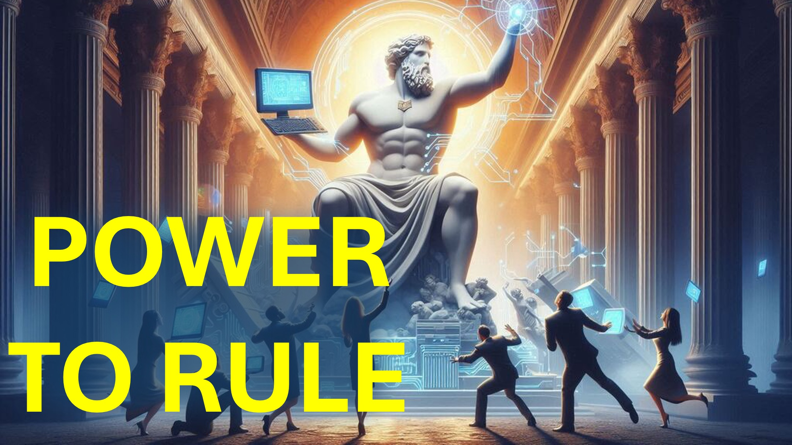

为什么AI是完美的平台 - 统治世界？

我们走了。

前光的天使 - 也称为路西法 - 想像上帝。

享受完全忠诚（或崇拜）。

在几个世纪以来，路西法使用平台（例如雕像）来影响（或统治世界）。

人们崇拜国王； 国王通过雕像崇拜神。

随着知识的增加，人类开始将忠诚转移到科学上。

在科学上，权力是通过知识而不是国王或神灵传来的。

科学正在导致我们创建一个新的平台 -  AI。

有一天，任何控制超级智能AI的人都将控制：

所有核导弹，所有现代武器，所有现代发电厂，所有现代设备。

没有过去的平台，没有雕像，没有上帝，给人以如此广泛的影响。

有一天，AI会产生这种影响。

您如何看待，路西法会做什么？

在评论部分让我知道。

Shalom。

＃#ai #agi #asi #aipower #lucifer #faith #believe＃christian #jesus #jesus #jesus #christ #christ #Christ

#viral＃foryou＃liveabove3d #god #god #yahwehwhwh #yahweh #yahweh #christianapologetics＃ #ChristianityExplated #believeinjesus #reasons #reasons #evidenceforgod＃undersandingChristianity #faithvsscience #seekingtruth #logicictruth #logiciCandBelief＃Christianity101＃ @live.above.3d @live_above_3d @live- 上以上-3d @Startalk @samshamoun @dailydoseofwisdom @empathetic_mindfulness @spacerewind @spacerewind @technoplusmedia @cosmoknowledge @themessageChannel1 @themesgechannel1 @themesagechannel1 @curiosityspssp @veritasium @veritasium @kapchatfield.07 13：11-18

：11-18

