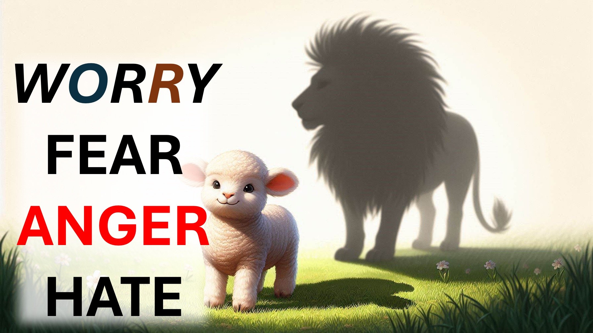

عندما يخشى الفريسة أنه يعمل.

عندما يخاف المفترس ، فإنه يخرج.

عندما يخاف الإنسان -

ماذا تفعل عندما تخاف؟

ماذا لو كانت المشكلة ، هل يجب أن تشعر بالقلق؟

أعني ، ألا تقلق بشأن احترار الأرض؟

ألا تقلق بشأن الفيضان المهاجرين إلى بلدك؟

تذكر (المستشار الرائع) يسوع؟

لا يريد منا أن نقلق بشأن أي شيء.

قال يسوع: "لا تقلق".

لا تقلق بشأن ما تأكله أو ارتداءه.

إذا اعتنى الله بالعشب والطيور ، فكم سيعتني بك.

هل أنت لست أكثر قيمة من الطيور؟

أي منكم ، بالقلق ، يمكنه إضافة مكوب واحد إلى طولك - أو لحظة في حياتك؟

كن مطمئنًا ، أن أبيك السماوي يعرف ما تحتاجه. - ماثيو 6 من الآية 25.

هممم.

توقف عن القلق ، بحيث يكون المساعدة الحالية لله ، سيصل إليك.

شالوم.

#Immigrants #globalwarming #worry #faith #believe #christian #love #jesus #Christ faithandreason #truthinchristianity #scienceandfaith #ChristianityExplied #believeInjesus #Reasonsforfaith #Evidenceforgodgodgodgodgodgodgodgodgodgodgodgodged #faithiMatiMiStizing #hope #inspiration #beyondthephysical

live. أعلاه IRB ~ ~~

آيات الكتاب المقدس

ماثيو 6: 25-34

متى 11:15

علامة 4:91:15

مارك 4: 9