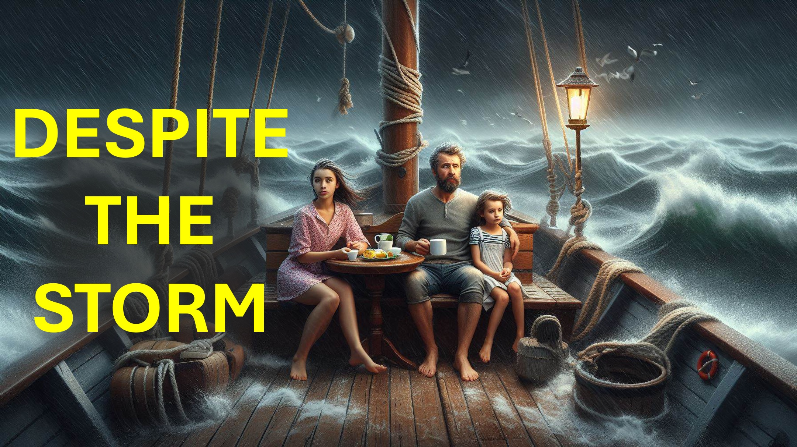

जब सब कुछ है तो आप क्या करते हैं?

कुछ मदद के लिए अपने पिता से रोते हैं।

यह ठीक है।

हालांकि, जो मसीह की महिमा पी रहा है, वह कहेगा:

"मेरे पिता इस बारे में जानते हैं"।

"यह मेरे पिता की महिमा के लिए है"।

"मैं यीशु की महिमा करना जारी रखूंगा चाहे कोई भी हो"।

"मैं उन लोगों को आशीर्वाद देता हूं जिन्होंने मेरे साथ बहुत बुरा व्यवहार किया है"।

"क्या मेरे पिता किसी भी चीज़ के बारे में चिंतित हैं?"

"कौन नहीं जानता कि मैं अपने पिता की नकल करता हूं जो स्वर्ग में है?"

hmmm

पिता की तरह होने के लिए, हमें परेशानियों से नहीं जाना चाहिए।

परेशानियों से नहीं हटने के लिए, हमें इस दुनिया की देखभाल के लिए मृत होना चाहिए।

इस दुनिया में मरने के लिए, हमें मसीह की महिमा के साथ नशे में होना चाहिए।

मेरे साथ प्रार्थना करें।

"प्रिय पिता, मैंने अपनी ताकत पर भरोसा किया - वह अतीत है"।

"अब मैं उठता हूं, उस अनुग्रह के साथ जो मसीह यीशु में है और पवित्र आत्मा की शक्ति है"।

"मैं आगे जाता हूं और मेरे पास है - आपके राज्य के लिए"।

"यीशु के नाम में - आमीन"।

#gloryofchrist #holyspiritfilled #troubles #faith #believe #christian #love #christ  

#viral #foryou #liveabove3d #god #yhwh #yahweholologologologeticachtics # सादे #believeinjesus #ReasonsForFaith #EvidemForGod #UnderStandingChristianity #FaithVSscience #SeekingTruth d @लाइव-एबोव -3 डी @ StarTalk @samshamoun @dailydoseofwisdom @Empathetic_Mindfulness @SpaceRewind @technoplusmedia @Cosmoknowledge @themessagechannel1 @CuriositySp @veritasium @kapchatfield.07 @ken.arrington @tedtoks @the.anonymous.prophet @offthekirb

LEARN MORE

Website: www.liveabove3d .com

YouTube: www.youtube.com/@live.above.3d

 tiktok: www.tiktok.com/@live.above.3d

ट्विटर: www.twitter.com/live_above_3d   Reddit: www.reddit.com/user/live-above-3d

Instagram: www.instagram.com/live.above.3d

facebook: www.facebook.com/profile/100092339087423       छंद

मैथ्यू 6: 8

1 कुरिन्थियों 10:31

1 थिस्सलोनियन्स 5:18

रोमियों 11:36
मैथ्यू 5:44
भजन 2: 2-4
 इफिसियों 5: 1 (niv)
रोमियों 8: 5
रोमियों 8: 6
इफिसियों 5: 18-20omans 8: 5
रोमियों 8: 6
ephesians 5: 18-20