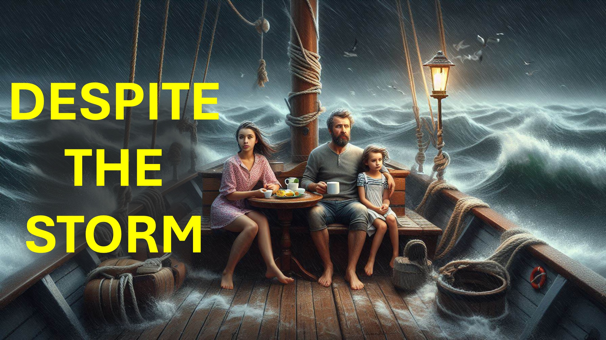

すべてがhaywireになったとき、あなたは何をしますか？

助けを求めて父親に叫ぶ人もいます。

これは大丈夫です。

しかし、キリストの栄光を飲んでいる人は次のように言います：

「私の父はこれを知っています」。

「これは私の父の栄光のためです」。

「私は何があってもイエスを称賛し続けます」。

「私は私を恐ろしく扱った人々を祝福します」。

「父は何かを心配していますか？」

「私が天国にいる父を模倣したことを誰が知らないのですか？」

うーん

父親のようになるために、私たちはトラブルに感動してはなりません。

トラブルに感動しないように、私たちはこの世界の世話に死んでいるに違いありません。

この世界に死ぬために、私たちはキリストの栄光に酔っているに違いありません。

私と一緒に祈ってください。

「親愛なる父、私は自分の強さに頼っていました - それは過去です」。

「今、私は立ち上がって、キリスト・イエスと聖霊の力にある恵みとともに」。

「私は出て、私はあなたの王国のために - 私は所有しています」。

「イエスの名前 - アーメン」。

#GloryOfChrist #HolySpiritFild #troubles #faith #believe #christian #love #jesus＃christ

#foryou＃liveabove3d #god Beliedinjesus ＃reasonsforfith #evidenceforgod #understandingchristianity #faithvsscience #seekingtruth＃logicandbelief＃christiantisisms＃debunkingmyths live-above-3d @ Startalk @samshamoun @dailydoseofwisdom @mathetic_mindfultion @spacerewind @technoplusmedia @cosmoknowledge @themessagechannel1 @curiositysp @veritasium @kapchatfield.07 @ken.arrington @tedoks 3D .com

youtube：www.youtube.com/@live.above.3d

tiktok：www.tiktok.com/@live.above.3d

twitter：www.twitter.com/live_above_3d  〜RedDit：www.reddit.com/user/live-above-3d

Instagram：www.instagram.com/live.above.3d

Facebook：www.facebook.com/profile/100092339087423

bible 詩

マタイ6：8

1コリント10:31

1テサロニアン5:18

ローマ人11:36

マタイ5:44
詩sal2：2-4
エペソ人への手紙5：1（NIV）
ローマ人8：5
ローマ人8：6
エペソ人5：18-20マンズ8：5
ローマ人8：6
エペソ人5：18-20