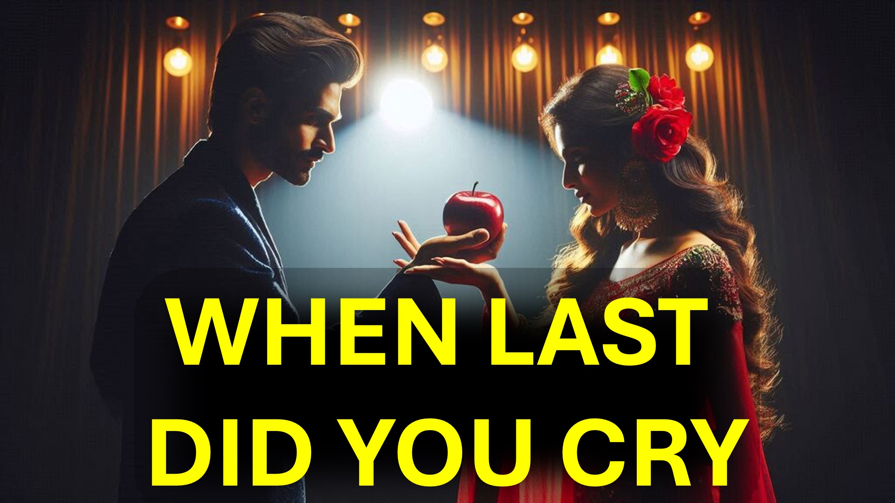

最後に泣きましたか？

これは誘惑と何の関係がありますか？

それはあなたを驚かせるでしょう。

うーん。

あなたは同じ弱点に戻り続けていますか？

あなたが先に進み始めたとき、あなたは同じ弱点にいることに気づきます。

これがなぜ起こるのかを伝えることができましたが、克服する方法をお伝えしたいと思います。

イエスは

「あなたが誘惑に入らないように見て、祈る」

、見てください - 神の霊のリードに従って、祈ってください。

それから、誘惑が来ると、あなたの反応は神を称賛します。

うーん。

真剣に祈るように勧められない場合はどうなりますか？

それならあなたは私たちを祈る神の光が必要です。

あなたはそれを聞いた - 私たちを祈るのは神です。

だから、神に泣きなさい、主が聞いて、あなたを弱さから救うからです。

私たちの救い主のイエスでさえ、彼の肉の時代に、大声で叫び声と涙を浮かべて祈りと嘆願を捧げ、彼は彼の敬意のために聞かれました。

シャローム。

#temptation #prayer #tears #cries #supplication #jesus＃christian #love #faith＃yahweh #god

#viral＃foryou＃liveabove3d #god #believeinjesus #reasonsforfith #evidenceforgod #understandychristianity #faithvsscience #seekingtruth＃logicandbeLief live_above_3d @live-above- 3D @samshamoun @dailydoseofwisdom @empathetic_mindfulness @spacerewind @technoplusmedia @cosmoknowledge @themessagechannel1 @curiositysp @veritasium @kapchatfield.07 @ken.arrington @tedtoks .liveabove3d.com

YouTube：www.youtube.com/@live.above.3d

tiktok：www.tiktok.com/@live.above.3d

twitter：www.twitter.com/live_above_3d

reddit：www.reddit.com/user/live-above-3d

Instagram：www.instagram.com/live.above.3d

facebook：www.facebook.com/profile/100092339087423 ~~ ~~ 〜聖書の詩

マタイ26:41

フィリピア人2:13

詩編34:17

ヘブライ5：7（ESV）

詩編34:17
ヘブライ5：7（ESV ））