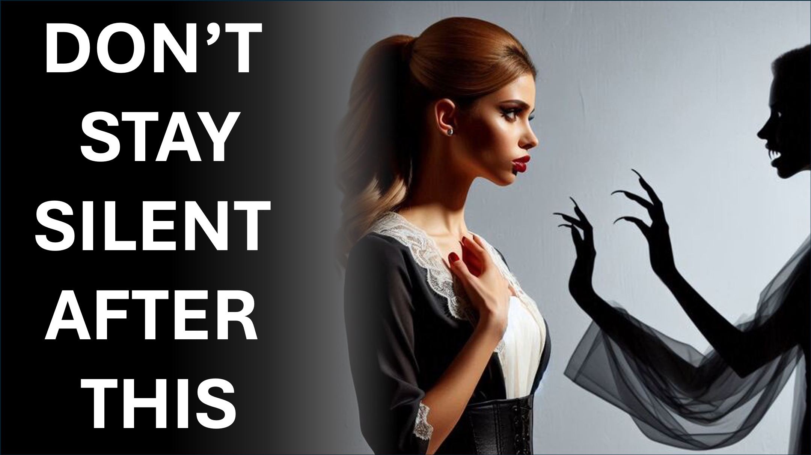

Asla hastalığa tahammül etmeyin.

İşte hastalığı yerinden etmek için güçlü kelimeler.

Hmmm.

Ah hastalık, gerçeği biliyorum.

Yazılmış ve şimdi diyorum ki: “Yaraları ile iyileştim”

İsa hastalık haline geldi ve katlandı, böylece bunu acı çekmem gerekmiyor.

Sizi en kısa sürede bile katlarsam, İsa'nın boşuna acı çekmesini sağlayacağım.

Hayır! Ben değil.

Cennetteki Babam değil - herhangi bir adaletsizliğe izin vermeyecek.

İsa acı çektiğinden, onun adına zevk alıyorum.

Ah hastalık, Tanrı'nın rahatsız edici sözünü duyun.

İsa boşuna acı çekmediğinden, seni bedenimden, İsa'nın adına çekiyorum.

Hastalık ölmek ve artık olmayın, çünkü İsa'nın yaraları tarafından iyileştim.

Hallelujah!

Bu videonun ikinci kısmı yarın çıkıyor.

Tanrı'nın onu izlemenizi istediğine inanıyorum.

Abone olun, bilgilendirileceksiniz.

Shalom.

#sickness #health #redemption #salvation #jesus #christian #love #faith #yahweh #god

#viral #foryou #LiveAbove3D #god #jesus #ChristianApologetics #LoveOfGod #FaithAndReason #TruthInChristianity #ScienceAndFaith #ChristianityExplained #BelieveInJesus #Reasonsforfaith #EvidenceForgod #Anderstancingchristianity #Faithvsscience #Seekingtruth #LogicandBelief #Christianity101 #godandingatheism #DiscoveringFaith #Bristhephicaling #blessing #Hope #Beyondthishical #blessed #Hope Live-A-A-A-A-3D @ samshamoun @dailydoseofwisdom @Empathetic_Mindfulness @SpaceRewind @technoplusmedia @Cosmoknowledge @themessagechannel1 @CuriositySp @veritasium @kapchatfield.07 @ken.arrington @tedtoks @the.anonymous.prophet @offthekirb @StarTalk

LEARN MORE

Website: www.liveabove3d .com

YouTube: www.youtube.com/@live.above.3d

Tiktok: www.tiktok.com/@live.above.3d

Twitter: www.twitter.com/live_above_3d

   Reddit: www.reddit.com/user/live-ebove-3d

Instagram: www.instagram.com/live.above.3d

Facebook: www.facebook.com/profile/100092339087423.php? = 100092339087423
