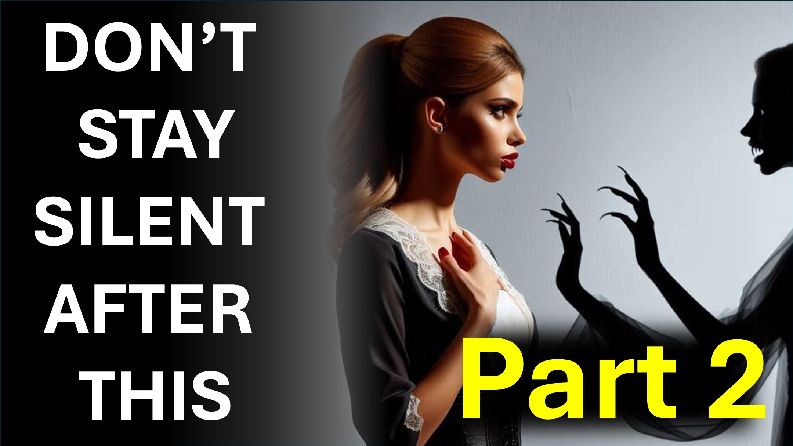

1 부 - https://www.youtube.com/shorts/vxc2p8wpfry
https://www.tiktok.com/@live.above.3d/video/74125267986444202785

1 부에서는 질병을 탈구하십시오.

너무나 악마는 잘못된 생각에 몰래 들어 가려고 할 것입니다.

이 답변으로 그를 탈구하십시오.

“단지 작은 질병입니다.”

예수께서는 병이되어 견뎌 냈기 때문에 나는 이것을 겪을 필요가 없습니다.

내가 가장 짧은 시간 동안이 병을 견딜 수 있다면, 나는 예수의 고통을 헛된 것입니다.

“당신은 하나님과 옳지 않지만 치유되기를 원합니다.”

만약 죄를 지키지 않은 예수가 나를 대신하여 죄가 되었다면; 그렇다면 죄를 아는 사람은 하나님의의를 맞았습니다.

“이 질병은 시험입니다.”

질병, 저를 시험해 보도록 하느님의 허락을 구해주는 것은 괜찮습니다.

하나님 께서 저를 승인 하셨기 때문에 당신을 캐스팅해도 괜찮습니다.

나는 시험을 통과한다. 예수 이름으로 지금 당신을 캐스팅합니다.

이것을 그들과 공유함으로써 다른 사람들을 축복하십시오.

샬롬.

#sickness #Health #Redemption #Salvation #JESUS ​​#CHRISTIAN #LOVE #FAITH #YAHWEH #GOD

#viral #foryou #liveabove3d #jesus #loveofgod #faithandristianity #SciEniCIniC #CIENITINIC #CIENITINITINITION ESUS #RISSERFAITH #EvidenceForGod #FaithvsScience #SeekingTruth #LogicAndBelief #QuestionIngeatheism #DeBunkingMyths #GodandScience ##ChristianLiving #Heinsportes ~ heindthepys ~ warty ~ warly the the the theportations #heportations #hepsy ~ hepory ~ heportings 그레이션, 그는 그랬습니다 우리의 죄악에 대한 타박상 : 우리의 평화의 징계는 그분에게있었습니다. 그리고 그의 줄무늬로 우리는 치유됩니다.

이사야 53 : 5

누가 자신의 자기 자신이 나무에있는 자신의 몸에 우리의 죄를 가라 앉히고, 우리는 죄로 죽은 사람이 의로움으로 살아야한다.

베드로 전서 2:24

그분은 그를 죄를 짓지 않았던 우리를 위해 죄로 만들었습니다. 우리는 그분 안에서 하나님의의를 만들 수 있습니다.

고린도 후서 5:21

이 징후는 그들을 믿는 그들을 따라야한다. 내 이름으로 그들은 악마를 쫓아 낼 것입니다. 그들은 새로운 방언으로 말할 것이다.

마가 16:17

그러나 믿음 없이는 그분을 기쁘게하는 것이 불가능합니다. 하나님 께 간주하는 사람은 그분이 자신을 믿어야하며, 그분은 부지런히 그를 찾는 그들의 보상 자라는 것을 믿어야합니다.

히브리서 11 : 6 k 그는.

히브리서 11 : 6

